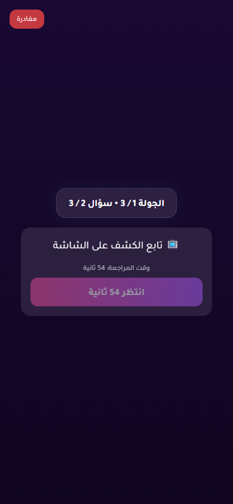

# Issue 1 Random Vote Stress Report

- Status: **PASS**
- Target URL: https://fgsh-web.vercel.app
- Started: 2026-06-06T16:50:32.273Z
- Completed: 2026-06-06T16:51:57.225Z
- Random seed: 606901
- Runs requested: 1
- Player range: 6-6
- Rounds per room: 2
- Credentials: supplied through environment variables and intentionally not logged.

## Runs

| Run | Status | Players | Mode | Duration ms | Game | Round | Details |
| ---: | --- | ---: | --- | ---: | --- | --- | --- |
| 1 | PASS | 6 | mixed | 84411 | DB246H | 986f7f0f-afd5-4dc2-b5b6-1ab94bffe123, 78972782-9a48-45b9-a917-681bb3e26a9b | R1 holdback 6/6; R2 simultaneous 6/6 vote rows persisted exactly once and matched clicked answer IDs. |

## Diagnostics

- Console/page/request records captured: 27
- Relevant error records: 0

_No relevant framework/runtime errors were recorded._

## Blockers / Failures

_No blockers recorded._

## Screenshots

run 1 round 1 completed player state

run 1 round 2 completed player state

