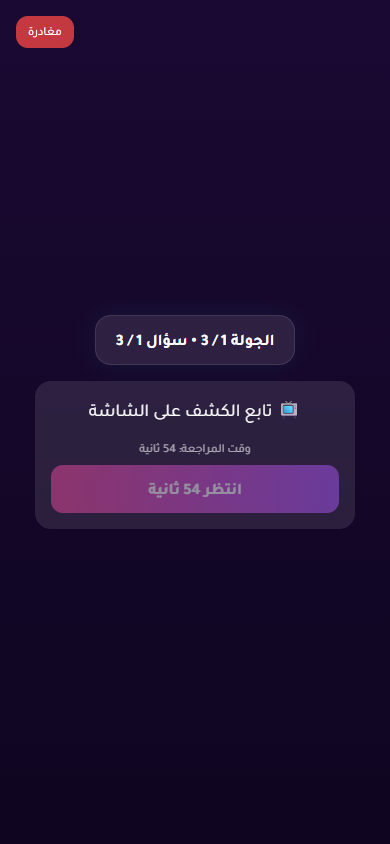
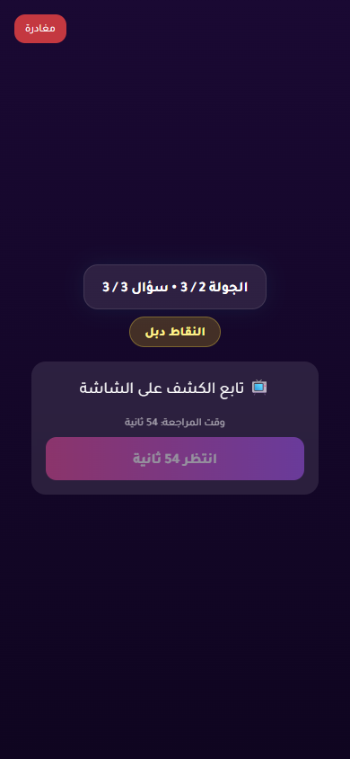

# Issue 1 Random Vote Stress Report

- Status: **PASS**
- Target URL: https://fgsh-web.vercel.app
- Started: 2026-06-06T16:52:17.180Z
- Completed: 2026-06-06T17:18:56.670Z
- Random seed: 606404
- Runs requested: 3
- Player range: 6-10
- Rounds per room: 7
- Credentials: supplied through environment variables and intentionally not logged.

## Runs

| Run | Status | Players | Mode | Duration ms | Game | Round | Details |
| ---: | --- | ---: | --- | ---: | --- | --- | --- |
| 1 | PASS | 9 | mixed | 582666 | OJZIPV | 46d43e04-3480-472a-80ac-ff6fe9e917af, 27a10830-a876-4249-b811-5da1b8c3a4af, 5580c43a-7cd1-4b70-9e6a-e1c58c3fcdaf, 66a11364-8d4a-4046-8fac-d0cd315e298b, 6f240924-f19a-4eaa-9fb3-1ad0dd7f7649, 29bb9e7a-c212-4dba-b91c-673bd40a65c5, 5ba907d9-b912-4a70-b83c-618e4b1fd994 | R1 holdback 9/9; R2 simultaneous 9/9; R3 staggered 9/9; R4 change-before-confirm 9/9; R5 reload-after-save 9/9; R6 late-burst 9/9; R7 holdback 9/9 vote rows persisted exactly once and matched clicked answer IDs. |
| 2 | PASS | 9 | mixed | 569152 | KRZM0C | 4c45c658-c57b-420a-bd33-fb49a0f2f18a, 765aa21b-b2b9-4d34-8dbf-29147555f6b6, 831a0a62-a8e3-43dd-91a2-94184ea9058f, dcb45926-2fa1-4123-ac9b-d7c1c95ca059, ccdcad2d-8907-4dea-90be-897ac027e13a, 06578c49-1d11-4201-962d-58926ce87eda, 4b75afff-d912-4137-8bca-1acc9cdee3df | R1 simultaneous 9/9; R2 staggered 9/9; R3 change-before-confirm 9/9; R4 reload-after-save 9/9; R5 late-burst 9/9; R6 holdback 9/9; R7 simultaneous 9/9 vote rows persisted exactly once and matched clicked answer IDs. |
| 3 | PASS | 6 | mixed | 446848 | EFAG47 | 78e1f660-221e-4eb7-9ab0-eb370306085c, 2d486a27-e638-407c-a631-9b9752817437, 412b179e-3661-4361-bc34-9ac26f84a1a9, 9eedc8a3-602b-44a7-b3ff-8f78df308f7c, 7d768a78-09d4-4924-a9bd-951b69169906, 50564930-69f7-4b13-b7fd-96b19bc971ee, 5ccbbe04-db8f-47b6-98fd-108e3c6d9dff | R1 staggered 6/6; R2 change-before-confirm 6/6; R3 reload-after-save 6/6; R4 late-burst 6/6; R5 holdback 6/6; R6 simultaneous 6/6; R7 staggered 6/6 vote rows persisted exactly once and matched clicked answer IDs. |

## Diagnostics

- Console/page/request records captured: 327
- Relevant error records: 8

| Run | Source | Type | Status | URL | Message |
| ---: | --- | --- | ---: | --- | --- |
| 2 | I1R02 P01 | requestfailed |  | https://yabticelgerjwzrhyaye.supabase.co/rest/v1/player_answers?select=answer_text&round_id=eq.dcb45926-2fa1-4123-ac9b-d7c1c95ca059&player_id=eq.57bebd55-3519-41ec-bd04-84718f05b65c | net::ERR_ABORTED |
| 2 | I1R02 P03 | requestfailed |  | https://yabticelgerjwzrhyaye.supabase.co/rest/v1/player_answers?select=answer_text&round_id=eq.dcb45926-2fa1-4123-ac9b-d7c1c95ca059&player_id=eq.aa69b6c4-073d-497f-a4ff-534be6b72e2b | net::ERR_ABORTED |
| 2 | I1R02 P04 | requestfailed |  | https://yabticelgerjwzrhyaye.supabase.co/rest/v1/votes?select=answer_id&round_id=eq.dcb45926-2fa1-4123-ac9b-d7c1c95ca059&voter_id=eq.a053fd4e-c2d8-45cd-b6d8-68f399d25e09 | net::ERR_ABORTED |
| 2 | I1R02 P06 | requestfailed |  | https://yabticelgerjwzrhyaye.supabase.co/rest/v1/player_answers?select=*%2Cplayer%3Aplayers%28*%29&round_id=eq.dcb45926-2fa1-4123-ac9b-d7c1c95ca059&order=submitted_at.asc%2Cid.asc | net::ERR_ABORTED |
| 2 | I1R02 P06 | console |  | https://fgsh-web.vercel.app/game | [error] [Game] Recovery failed: {message: TypeError: Failed to fetch, name: GameError, stack: GameError: TypeError: Failed to fetch     at Fr.fe…web.vercel.app/assets/index-b14bacc7.js:374:33470} |
| 3 | I1R03 P04 | requestfailed |  | https://yabticelgerjwzrhyaye.supabase.co/rest/v1/votes?select=answer_id&round_id=eq.412b179e-3661-4361-bc34-9ac26f84a1a9&voter_id=eq.67abde43-400f-4db2-8603-d639cb5af872 | net::ERR_ABORTED |
| 3 | I1R03 P05 | requestfailed |  | https://yabticelgerjwzrhyaye.supabase.co/rest/v1/player_answers?select=*%2Cplayer%3Aplayers%28*%29&round_id=eq.412b179e-3661-4361-bc34-9ac26f84a1a9&order=submitted_at.asc%2Cid.asc | net::ERR_ABORTED |
| 3 | I1R03 P05 | console |  | https://fgsh-web.vercel.app/game | [error] [Game] Recovery failed: {message: TypeError: Failed to fetch, name: GameError, stack: GameError: TypeError: Failed to fetch     at Fr.fe…web.vercel.app/assets/index-b14bacc7.js:374:33470} |

## Blockers / Failures

_No blockers recorded._

## Screenshots

run 1 round 1 completed player state

run 1 round 2 completed player state

run 1 round 3 completed player state

run 1 round 4 completed player state

run 1 round 5 completed player state

run 1 round 6 completed player state

run 1 round 7 completed player state

run 2 round 1 completed player state

run 2 round 2 completed player state

run 2 round 3 completed player state

run 2 round 4 completed player state

run 2 round 5 completed player state

run 2 round 6 completed player state

run 2 round 7 completed player state

run 3 round 1 completed player state

run 3 round 2 completed player state

run 3 round 3 completed player state

run 3 round 4 completed player state

run 3 round 5 completed player state

run 3 round 6 completed player state

run 3 round 7 completed player state

