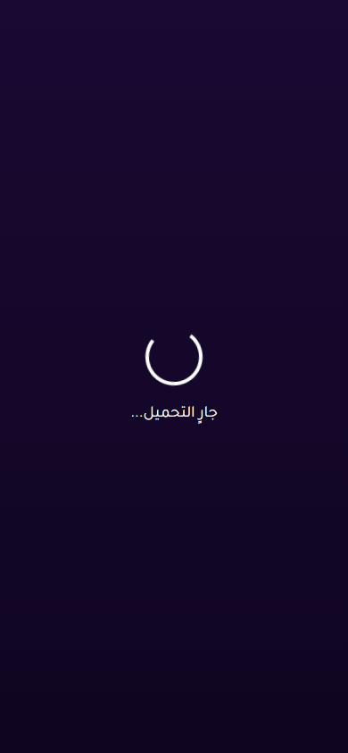

# Issue 1 Random Vote Stress Report

- Status: **PASS**
- Target URL: https://fgsh-web.vercel.app
- Started: 2026-06-06T16:32:32.051Z
- Completed: 2026-06-06T16:37:14.881Z
- Random seed: 606101
- Runs requested: 10
- Player range: 6-10
- Credentials: supplied through environment variables and intentionally not logged.

## Runs

| Run | Status | Players | Mode | Duration ms | Game | Round | Details |
| ---: | --- | ---: | --- | ---: | --- | --- | --- |
| 1 | PASS | 9 | holdback | 34815 | DSW2K4 | 5766cf48-e0bf-4f48-8fc0-4d3df709342c | 9/9 vote rows persisted exactly once and matched clicked answer IDs. |
| 2 | PASS | 10 | simultaneous | 23374 | KNLASO | 0908ac4e-200d-4456-a5d4-93feb07e5a79 | 10/10 vote rows persisted exactly once and matched clicked answer IDs. |
| 3 | PASS | 6 | staggered | 23730 | DVB44E | dbb1a6ca-3a45-4802-9e8e-49e81c2dfafe | 6/6 vote rows persisted exactly once and matched clicked answer IDs. |
| 4 | PASS | 10 | change-before-confirm | 23257 | EL1B0G | add7b7a9-c0c6-40e3-9fa1-4fea7d079867 | 10/10 vote rows persisted exactly once and matched clicked answer IDs. |
| 5 | PASS | 9 | reload-after-save | 23462 | T0RPWD | 27be8fbf-7856-47c9-8dd5-cdd1a78da18e | 9/9 vote rows persisted exactly once and matched clicked answer IDs. |
| 6 | PASS | 7 | late-burst | 55755 | 8GC7X3 | 63f77024-e5ad-448e-9425-51ae5e630c8c | 7/7 vote rows persisted exactly once and matched clicked answer IDs. |
| 7 | PASS | 10 | holdback | 27535 | H2R94K | ff32d182-267f-4744-bf5a-274c0b777c2e | 10/10 vote rows persisted exactly once and matched clicked answer IDs. |
| 8 | PASS | 10 | simultaneous | 21438 | F8REQP | dab4589b-816f-4d0d-97c8-f500763c8682 | 10/10 vote rows persisted exactly once and matched clicked answer IDs. |
| 9 | PASS | 7 | staggered | 24631 | F9K8AA | 524a1386-bc01-4a05-9188-828c49dd1c33 | 7/7 vote rows persisted exactly once and matched clicked answer IDs. |
| 10 | PASS | 6 | change-before-confirm | 23509 | A977PJ | c5ac98f5-2577-4945-abe3-94b15fd25249 | 6/6 vote rows persisted exactly once and matched clicked answer IDs. |

## Diagnostics

- Console/page/request records captured: 245
- Relevant error records: 6

| Run | Source | Type | Status | URL | Message |
| ---: | --- | --- | ---: | --- | --- |
| 5 | I1R05 P02 | requestfailed |  | https://yabticelgerjwzrhyaye.supabase.co/rest/v1/players?select=*&game_id=eq.a5da73f4-6d7b-411a-b550-c50f87628621&connection_status=eq.connected | net::ERR_ABORTED |
| 5 | I1R05 P02 | requestfailed |  | https://yabticelgerjwzrhyaye.supabase.co/rest/v1/games?select=current_round&id=eq.a5da73f4-6d7b-411a-b550-c50f87628621 | net::ERR_ABORTED |
| 5 | I1R05 P02 | requestfailed |  | https://yabticelgerjwzrhyaye.supabase.co/rest/v1/votes?select=answer_id&round_id=eq.27be8fbf-7856-47c9-8dd5-cdd1a78da18e&voter_id=eq.2d0f785e-256c-4c4a-b911-8c7a38aff2c9 | net::ERR_ABORTED |
| 5 | I1R05 P02 | requestfailed |  | https://yabticelgerjwzrhyaye.supabase.co/rest/v1/games?select=*&id=eq.a5da73f4-6d7b-411a-b550-c50f87628621 | net::ERR_ABORTED |
| 5 | I1R05 P02 | console |  | https://fgsh-web.vercel.app/game | [error] ❌ SyncService: Sync failed for game a5da73f4-6d7b-411a-b550-c50f87628621 {message: Failed to fetch game: TypeError: Failed to fetch, name: Error, stack: Error: Failed to fetch game: TypeError: Failed to …eb.vercel.app/assets/index-b14bacc7.js:285:69738)} |
| 5 | I1R05 P01 | requestfailed |  | https://yabticelgerjwzrhyaye.supabase.co/rest/v1/votes?select=answer_id&round_id=eq.27be8fbf-7856-47c9-8dd5-cdd1a78da18e&voter_id=eq.3f86b6c5-1388-4f20-b52f-2e4dfc074f40 | net::ERR_ABORTED |

## Blockers / Failures

_No blockers recorded._

## Screenshots

run 1 completed player state

run 2 completed player state

run 3 completed player state

run 4 completed player state

run 5 completed player state

run 6 completed player state

run 7 completed player state

run 8 completed player state

run 9 completed player state

run 10 completed player state

