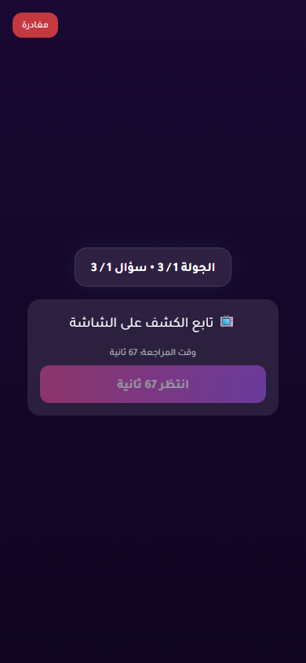
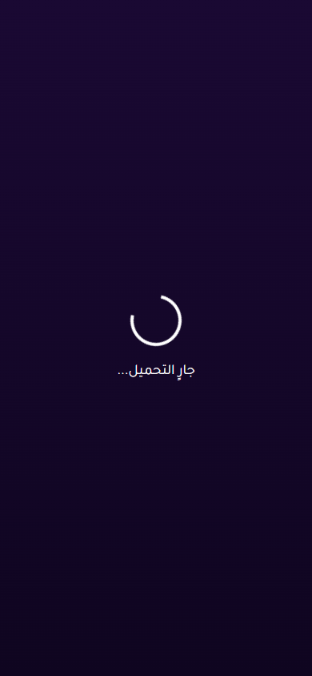

# Issue 1 Random Vote Stress Report

- Status: **PASS**
- Target URL: https://fgsh-web.vercel.app
- Started: 2026-06-06T16:37:46.368Z
- Completed: 2026-06-06T16:42:26.715Z
- Random seed: 606202
- Runs requested: 10
- Player range: 6-10
- Credentials: supplied through environment variables and intentionally not logged.

## Runs

| Run | Status | Players | Mode | Duration ms | Game | Round | Details |
| ---: | --- | ---: | --- | ---: | --- | --- | --- |
| 1 | PASS | 9 | holdback | 22874 | 6I7HQJ | 0bbf74f9-c8d7-4ab5-9f27-a60cd0e419cc | 9/9 vote rows persisted exactly once and matched clicked answer IDs. |
| 2 | PASS | 8 | simultaneous | 20772 | Y69PU0 | f7ba9536-5ffa-4362-8a83-ec5ba6aa719c | 8/8 vote rows persisted exactly once and matched clicked answer IDs. |
| 3 | PASS | 8 | staggered | 26439 | XZLLMW | a738bcc7-abac-4888-9065-077c8f9cb67f | 8/8 vote rows persisted exactly once and matched clicked answer IDs. |
| 4 | PASS | 9 | change-before-confirm | 24149 | JAWJF6 | 8140bfcc-bcbd-47cc-9d95-ca50178b00e8 | 9/9 vote rows persisted exactly once and matched clicked answer IDs. |
| 5 | PASS | 8 | reload-after-save | 24666 | FRILSK | 92fa63ae-f7bd-4741-913c-a892bb9d9c59 | 8/8 vote rows persisted exactly once and matched clicked answer IDs. |
| 6 | PASS | 10 | late-burst | 63243 | WCTAF3 | 5b7fb7a3-683c-48a4-8861-dba7b32b02eb | 10/10 vote rows persisted exactly once and matched clicked answer IDs. |
| 7 | PASS | 8 | holdback | 28087 | COV64Y | 30c90046-d09e-4ee9-a6f7-16e80b75c31f | 8/8 vote rows persisted exactly once and matched clicked answer IDs. |
| 8 | PASS | 10 | simultaneous | 21269 | PWESCS | 5677cada-40c0-4fda-8927-dab98a419ff2 | 10/10 vote rows persisted exactly once and matched clicked answer IDs. |
| 9 | PASS | 10 | staggered | 24382 | D7UF4G | 197333dd-781a-4ffc-a86c-4446a1ee9d4d | 10/10 vote rows persisted exactly once and matched clicked answer IDs. |
| 10 | PASS | 9 | change-before-confirm | 23074 | LK8IF6 | c687020e-56f6-4c86-b4b1-d0c368c919dc | 9/9 vote rows persisted exactly once and matched clicked answer IDs. |

## Diagnostics

- Console/page/request records captured: 294
- Relevant error records: 5

| Run | Source | Type | Status | URL | Message |
| ---: | --- | --- | ---: | --- | --- |
| 5 | I1R05 P01 | requestfailed |  | https://yabticelgerjwzrhyaye.supabase.co/rest/v1/votes?select=answer_id&round_id=eq.92fa63ae-f7bd-4741-913c-a892bb9d9c59&voter_id=eq.e45e5027-d79f-44b4-a678-05c8ffd145be | net::ERR_ABORTED |
| 5 | I1R05 P03 | requestfailed |  | https://yabticelgerjwzrhyaye.supabase.co/rest/v1/player_answers?select=*%2Cplayer%3Aplayers%28*%29&round_id=eq.92fa63ae-f7bd-4741-913c-a892bb9d9c59&order=submitted_at.asc%2Cid.asc | net::ERR_ABORTED |
| 5 | I1R05 P03 | console |  | https://fgsh-web.vercel.app/game | [error] [Game] Recovery failed: {message: TypeError: Failed to fetch, name: GameError, stack: GameError: TypeError: Failed to fetch     at Fr.fe…web.vercel.app/assets/index-b14bacc7.js:374:33470} |
| 5 | I1R05 P04 | requestfailed |  | https://yabticelgerjwzrhyaye.supabase.co/rest/v1/player_answers?select=*%2Cplayer%3Aplayers%28*%29&round_id=eq.92fa63ae-f7bd-4741-913c-a892bb9d9c59&order=submitted_at.asc%2Cid.asc | net::ERR_ABORTED |
| 5 | I1R05 P04 | console |  | https://fgsh-web.vercel.app/game | [error] [Game] Recovery failed: {message: TypeError: Failed to fetch, name: GameError, stack: GameError: TypeError: Failed to fetch     at Fr.fe…web.vercel.app/assets/index-b14bacc7.js:374:33470} |

## Blockers / Failures

_No blockers recorded._

## Screenshots

run 1 completed player state

run 2 completed player state

run 3 completed player state

run 4 completed player state

run 5 completed player state

run 6 completed player state

run 7 completed player state

run 8 completed player state

run 9 completed player state

run 10 completed player state

