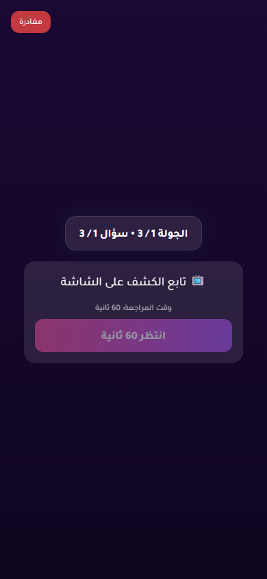

# Issue 1 Random Vote Stress Report

- Status: **PASS**
- Target URL: https://fgsh-web.vercel.app
- Started: 2026-06-06T16:43:04.926Z
- Completed: 2026-06-06T16:47:52.009Z
- Random seed: 606303
- Runs requested: 10
- Player range: 6-10
- Credentials: supplied through environment variables and intentionally not logged.

## Runs

| Run | Status | Players | Mode | Duration ms | Game | Round | Details |
| ---: | --- | ---: | --- | ---: | --- | --- | --- |
| 1 | PASS | 9 | holdback | 28091 | 26HM2F | 0b248570-fcae-42d3-8efb-4ee1b307ac7b | 9/9 vote rows persisted exactly once and matched clicked answer IDs. |
| 2 | PASS | 10 | simultaneous | 25385 | HPCOUZ | 169088d5-084a-49eb-8a65-59cee382c881 | 10/10 vote rows persisted exactly once and matched clicked answer IDs. |
| 3 | PASS | 7 | staggered | 25649 | 1N7VJK | d37e5fdc-3177-4e80-9856-ee2e340545e5 | 7/7 vote rows persisted exactly once and matched clicked answer IDs. |
| 4 | PASS | 8 | change-before-confirm | 22905 | 23V5IC | b51b8df3-ce0c-41f1-81cf-c36a5c17cb24 | 8/8 vote rows persisted exactly once and matched clicked answer IDs. |
| 5 | PASS | 6 | reload-after-save | 23531 | 3PHGH8 | 4ce2630c-ea64-4839-8212-5231f4a89e2f | 6/6 vote rows persisted exactly once and matched clicked answer IDs. |
| 6 | PASS | 8 | late-burst | 58602 | W80D6I | 345a2796-a561-4e11-8efb-86d81e69c14a | 8/8 vote rows persisted exactly once and matched clicked answer IDs. |
| 7 | PASS | 10 | holdback | 27687 | 2VXETW | 4d568e80-bd0d-47ef-88ff-a8538e9a27ac | 10/10 vote rows persisted exactly once and matched clicked answer IDs. |
| 8 | PASS | 7 | simultaneous | 21899 | 5MEB1B | ddf70c05-3f46-44d9-8102-35da1623f98d | 7/7 vote rows persisted exactly once and matched clicked answer IDs. |
| 9 | PASS | 7 | staggered | 28510 | 02PRUK | 8d6fd5a3-b6b2-42eb-8599-d1af84860283 | 7/7 vote rows persisted exactly once and matched clicked answer IDs. |
| 10 | PASS | 6 | change-before-confirm | 23534 | K92X2E | 1bc96752-4030-464b-b647-3de6316ce831 | 6/6 vote rows persisted exactly once and matched clicked answer IDs. |

## Diagnostics

- Console/page/request records captured: 269
- Relevant error records: 2

| Run | Source | Type | Status | URL | Message |
| ---: | --- | --- | ---: | --- | --- |
| 5 | I1R05 P04 | requestfailed |  | https://yabticelgerjwzrhyaye.supabase.co/rest/v1/player_answers?select=*%2Cplayer%3Aplayers%28*%29&round_id=eq.4ce2630c-ea64-4839-8212-5231f4a89e2f&order=submitted_at.asc%2Cid.asc | net::ERR_ABORTED |
| 5 | I1R05 P04 | console |  | https://fgsh-web.vercel.app/game | [error] [Game] Recovery failed: {message: TypeError: Failed to fetch, name: GameError, stack: GameError: TypeError: Failed to fetch     at Fr.fe…web.vercel.app/assets/index-b14bacc7.js:374:33470} |

## Blockers / Failures

_No blockers recorded._

## Screenshots

run 1 completed player state

run 2 completed player state

run 3 completed player state

run 4 completed player state

run 5 completed player state

run 6 completed player state

run 7 completed player state

run 8 completed player state

run 9 completed player state

run 10 completed player state

