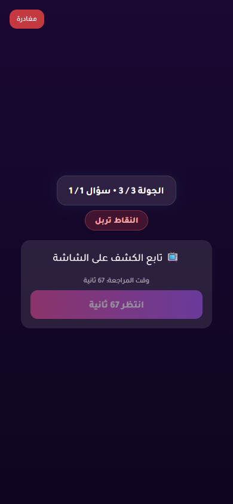
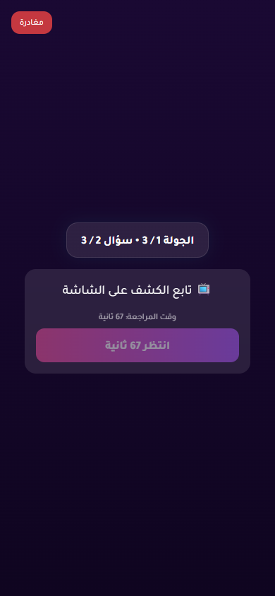
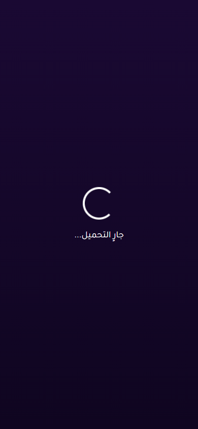

# Issue 1 Random Vote Stress Report

- Status: **PASS**
- Target URL: https://fgsh-web.vercel.app
- Started: 2026-06-06T17:38:49.188Z
- Completed: 2026-06-06T17:56:47.579Z
- Random seed: 707202
- Runs requested: 2
- Player range: 6-10
- Rounds per room: 7
- Credentials: supplied through environment variables and intentionally not logged.

## Runs

| Run | Status | Players | Mode | Duration ms | Game | Round | Details |
| ---: | --- | ---: | --- | ---: | --- | --- | --- |
| 1 | PASS | 8 | mixed | 538764 | RPSYCW | 061f7585-7832-45e2-b01a-31df8bbc3cf9, 4ec62e06-40d4-42e0-8d4a-5a1f6ad38e1a, 883a8d77-4717-4eb9-b969-a9004be8a81d, 14541398-685c-4401-9d62-5449d4873826, 2f1da0fc-6145-4e70-aa11-9fb672fc758a, 4bf7a132-82b1-423d-9aea-cc04533312b9, f6cf7cc6-145d-429f-aefc-b99ebce6cf52 | R1 holdback 8/8; R2 simultaneous 8/8; R3 staggered 8/8; R4 change-before-confirm 8/8; R5 reload-after-save 8/8; R6 late-burst 8/8; R7 holdback 8/8 vote rows persisted exactly once and matched clicked answer IDs. |
| 2 | PASS | 8 | mixed | 538880 | GV2MTB | 6869c4b7-4f27-48ca-91e3-a7841e3c4279, abb2caa1-5df5-4b08-ba66-d92ab7189adc, ab430f9e-741b-4ba3-b10f-dc451ce5c135, b74027b7-ccf7-4e50-bb43-962d5a7bfb70, 60d1083f-ea11-4aef-91cf-aa9a103aaf73, b5ba0df9-7b98-4a94-9e29-a038b0c24702, 3cb432e8-cff2-4aa4-a81f-14b329254e74 | R1 simultaneous 8/8; R2 staggered 8/8; R3 change-before-confirm 8/8; R4 reload-after-save 8/8; R5 late-burst 8/8; R6 holdback 8/8; R7 simultaneous 8/8 vote rows persisted exactly once and matched clicked answer IDs. |

## Diagnostics

- Console/page/request records captured: 220
- Relevant error records: 5

| Run | Source | Type | Status | URL | Message |
| ---: | --- | --- | ---: | --- | --- |
| 1 | I1R01 P03 | requestfailed |  | https://yabticelgerjwzrhyaye.supabase.co/rest/v1/player_answers?select=answer_text&round_id=eq.2f1da0fc-6145-4e70-aa11-9fb672fc758a&player_id=eq.9dc9c30a-6ddb-4f12-a648-b1827ad8c53a | net::ERR_ABORTED |
| 2 | I1R02 P02 | requestfailed |  | https://yabticelgerjwzrhyaye.supabase.co/rest/v1/player_answers?select=*%2Cplayer%3Aplayers%28*%29&round_id=eq.b74027b7-ccf7-4e50-bb43-962d5a7bfb70&order=submitted_at.asc%2Cid.asc | net::ERR_ABORTED |
| 2 | I1R02 P02 | console |  | https://fgsh-web.vercel.app/game | [error] [Game] Recovery failed: {message: TypeError: Failed to fetch, name: GameError, stack: GameError: TypeError: Failed to fetch     at Fr.fe…web.vercel.app/assets/index-b14bacc7.js:374:33470} |
| 2 | I1R02 P06 | requestfailed |  | https://yabticelgerjwzrhyaye.supabase.co/rest/v1/player_answers?select=*%2Cplayer%3Aplayers%28*%29&round_id=eq.b74027b7-ccf7-4e50-bb43-962d5a7bfb70&order=submitted_at.asc%2Cid.asc | net::ERR_ABORTED |
| 2 | I1R02 P06 | console |  | https://fgsh-web.vercel.app/game | [error] [Game] Recovery failed: {message: TypeError: Failed to fetch, name: GameError, stack: GameError: TypeError: Failed to fetch     at Fr.fe…web.vercel.app/assets/index-b14bacc7.js:374:33470} |

## Blockers / Failures

_No blockers recorded._

## Screenshots

run 1 round 1 completed player state

run 1 round 2 completed player state

run 1 round 3 completed player state

run 1 round 4 completed player state

run 1 round 5 completed player state

run 1 round 6 completed player state

run 1 round 7 completed player state

run 2 round 1 completed player state

run 2 round 2 completed player state

run 2 round 3 completed player state

run 2 round 4 completed player state

run 2 round 5 completed player state

run 2 round 6 completed player state

run 2 round 7 completed player state

