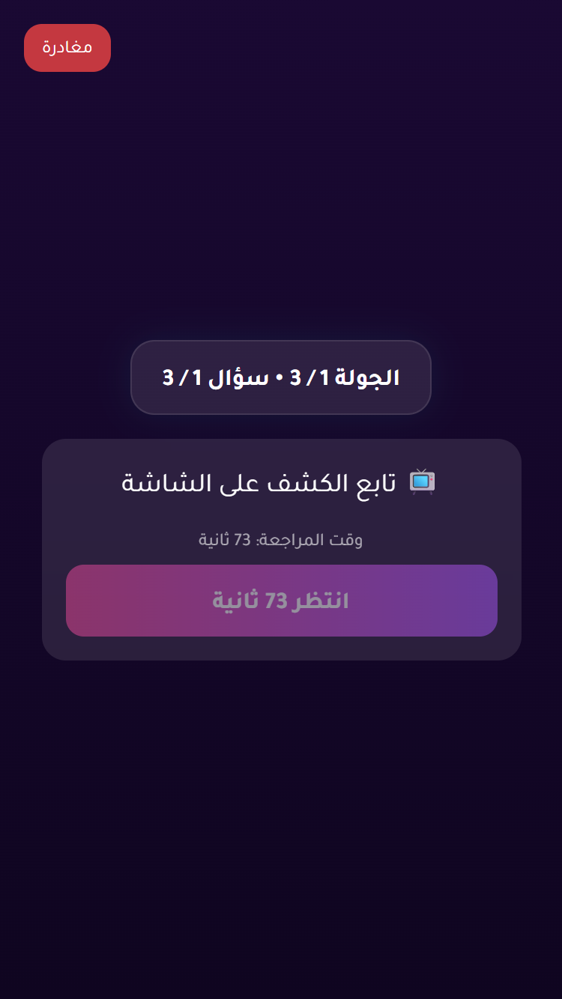

# Issue 1 Random Vote Stress Report

- Status: **PASS**
- Target URL: https://fgsh-web.vercel.app
- Started: 2026-06-06T17:58:54.479Z
- Completed: 2026-06-06T18:02:08.130Z
- Random seed: 707303
- Runs requested: 6
- Player range: 6-10
- Rounds per room: 1
- Browser engine: chromium
- Mobile viewport: 375x667@2
- Credentials: supplied through environment variables and intentionally not logged.

## Runs

| Run | Status | Players | Mode | Duration ms | Game | Round | Details |
| ---: | --- | ---: | --- | ---: | --- | --- | --- |
| 1 | PASS | 8 | holdback | 28303 | 0T2INA | 20abe648-80b8-47ce-b79f-443d59035354 | R1 holdback 8/8 vote rows persisted exactly once and matched clicked answer IDs. |
| 2 | PASS | 9 | simultaneous | 21811 | B9GTI8 | 18c1ff7a-cbc8-4388-a238-2bb49d2ff028 | R1 simultaneous 9/9 vote rows persisted exactly once and matched clicked answer IDs. |
| 3 | PASS | 10 | staggered | 28021 | RGVQNL | b62220e4-eeed-471c-94fb-5e13a29b8a2d | R1 staggered 10/10 vote rows persisted exactly once and matched clicked answer IDs. |
| 4 | PASS | 9 | change-before-confirm | 23631 | ZKWWW3 | 0707c493-9031-4085-9a01-9b2c96d7a8ff | R1 change-before-confirm 9/9 vote rows persisted exactly once and matched clicked answer IDs. |
| 5 | PASS | 10 | reload-after-save | 29243 | 0K1FG8 | 635cf3a4-33fd-4e22-9930-219b16255b51 | R1 reload-after-save 10/10 vote rows persisted exactly once and matched clicked answer IDs. |
| 6 | PASS | 7 | late-burst | 61635 | 1UPHLI | 46ba46bb-aa8d-4295-89a6-01474fcae245 | R1 late-burst 7/7 vote rows persisted exactly once and matched clicked answer IDs. |

## Diagnostics

- Console/page/request records captured: 166
- Relevant error records: 3

| Run | Source | Type | Status | URL | Message |
| ---: | --- | --- | ---: | --- | --- |
| 5 | I1R05 P06 | requestfailed |  | https://yabticelgerjwzrhyaye.supabase.co/rest/v1/player_answers?select=*%2Cplayer%3Aplayers%28*%29&round_id=eq.635cf3a4-33fd-4e22-9930-219b16255b51&order=submitted_at.asc%2Cid.asc | net::ERR_ABORTED |
| 5 | I1R05 P06 | console |  | https://fgsh-web.vercel.app/game | [error] [Game] Recovery failed: {message: TypeError: Failed to fetch, name: GameError, stack: GameError: TypeError: Failed to fetch     at Fr.fe…web.vercel.app/assets/index-b14bacc7.js:374:33470} |
| 5 | I1R05 P10 | requestfailed |  | https://yabticelgerjwzrhyaye.supabase.co/rest/v1/player_answers?select=answer_text&round_id=eq.635cf3a4-33fd-4e22-9930-219b16255b51&player_id=eq.0be27103-8abe-40e7-9c23-207e8fc56754 | net::ERR_ABORTED |

## Blockers / Failures

_No blockers recorded._

## Screenshots

run 1 round 1 completed player state

run 2 round 1 completed player state

run 3 round 1 completed player state

run 4 round 1 completed player state

run 5 round 1 completed player state

run 6 round 1 completed player state

