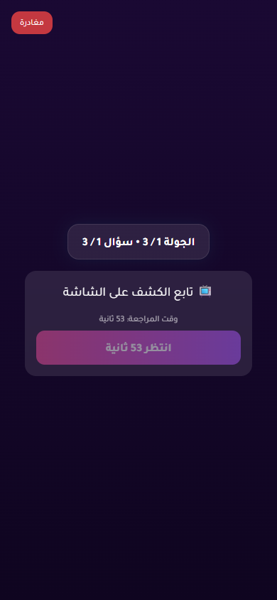

# Issue 1 Random Vote Stress Report

- Status: **PASS**
- Target URL: https://fgsh-web.vercel.app
- Started: 2026-06-06T17:33:32.215Z
- Completed: 2026-06-06T17:38:19.258Z
- Random seed: 707101
- Runs requested: 10
- Player range: 6-10
- Rounds per room: 1
- Credentials: supplied through environment variables and intentionally not logged.

## Runs

| Run | Status | Players | Mode | Duration ms | Game | Round | Details |
| ---: | --- | ---: | --- | ---: | --- | --- | --- |
| 1 | PASS | 8 | holdback | 23568 | MDEWG0 | 70b8ec82-5258-4344-8a97-9f165a92acd7 | R1 holdback 8/8 vote rows persisted exactly once and matched clicked answer IDs. |
| 2 | PASS | 7 | simultaneous | 22244 | 8M84ZZ | 4e6414cf-4317-47d8-a49c-6cf42105e41c | R1 simultaneous 7/7 vote rows persisted exactly once and matched clicked answer IDs. |
| 3 | PASS | 10 | staggered | 28503 | RTE8RN | 454cd262-ca60-49d1-9a93-6148f7e35a98 | R1 staggered 10/10 vote rows persisted exactly once and matched clicked answer IDs. |
| 4 | PASS | 6 | change-before-confirm | 21203 | 69GTCM | e8b469d0-639a-44f9-be5e-cf0bf5020074 | R1 change-before-confirm 6/6 vote rows persisted exactly once and matched clicked answer IDs. |
| 5 | PASS | 6 | reload-after-save | 25818 | 883XTL | 3571ca47-c01b-441a-9305-a0d5720dfec1 | R1 reload-after-save 6/6 vote rows persisted exactly once and matched clicked answer IDs. |
| 6 | PASS | 7 | late-burst | 62963 | W2LXDW | 89bf36ed-449b-4088-9025-558a7aeb83f7 | R1 late-burst 7/7 vote rows persisted exactly once and matched clicked answer IDs. |
| 7 | PASS | 9 | holdback | 28587 | BF416Q | 39873475-d253-4f8f-ace7-c42c542f718e | R1 holdback 9/9 vote rows persisted exactly once and matched clicked answer IDs. |
| 8 | PASS | 8 | simultaneous | 20974 | FF6NUO | 9003dbfe-7972-4fe6-a2e2-d02ac2bd4204 | R1 simultaneous 8/8 vote rows persisted exactly once and matched clicked answer IDs. |
| 9 | PASS | 10 | staggered | 27367 | 4H59AA | f7f9d371-8b9b-464a-9151-7f05bf356e68 | R1 staggered 10/10 vote rows persisted exactly once and matched clicked answer IDs. |
| 10 | PASS | 9 | change-before-confirm | 24502 | 2TSTSW | c3b78426-5048-45af-8d13-1ce10625c0a8 | R1 change-before-confirm 9/9 vote rows persisted exactly once and matched clicked answer IDs. |

## Diagnostics

- Console/page/request records captured: 278
- Relevant error records: 11

| Run | Source | Type | Status | URL | Message |
| ---: | --- | --- | ---: | --- | --- |
| 5 | I1R05 P06 | requestfailed |  | https://yabticelgerjwzrhyaye.supabase.co/rest/v1/votes?select=answer_id&round_id=eq.3571ca47-c01b-441a-9305-a0d5720dfec1&voter_id=eq.5d904853-69ee-401b-96bf-fe4623137a85 | net::ERR_ABORTED |
| 5 | I1R05 P05 | requestfailed |  | https://yabticelgerjwzrhyaye.supabase.co/rest/v1/player_answers?select=*%2Cplayer%3Aplayers%28*%29&round_id=eq.3571ca47-c01b-441a-9305-a0d5720dfec1&order=submitted_at.asc%2Cid.asc | net::ERR_ABORTED |
| 5 | I1R05 P05 | requestfailed |  | https://yabticelgerjwzrhyaye.supabase.co/rest/v1/players?select=*&game_id=eq.3c5fec27-206e-4450-b013-be07ab368518&connection_status=eq.connected | net::ERR_ABORTED |
| 5 | I1R05 P05 | requestfailed |  | https://yabticelgerjwzrhyaye.supabase.co/rest/v1/games?select=*&id=eq.3c5fec27-206e-4450-b013-be07ab368518 | net::ERR_ABORTED |
| 5 | I1R05 P05 | requestfailed |  | https://yabticelgerjwzrhyaye.supabase.co/rest/v1/games?select=current_round&id=eq.3c5fec27-206e-4450-b013-be07ab368518 | net::ERR_ABORTED |
| 5 | I1R05 P05 | console |  | https://fgsh-web.vercel.app/game | [error] [Game] Recovery failed: {message: TypeError: Failed to fetch, name: GameError, stack: GameError: TypeError: Failed to fetch     at Fr.fe…web.vercel.app/assets/index-b14bacc7.js:374:33470} |
| 5 | I1R05 P05 | console |  | https://fgsh-web.vercel.app/game | [error] ❌ SyncService: Sync failed for game 3c5fec27-206e-4450-b013-be07ab368518 {message: Failed to fetch game: TypeError: Failed to fetch, name: Error, stack: Error: Failed to fetch game: TypeError: Failed to …eb.vercel.app/assets/index-b14bacc7.js:285:69738)} |
| 5 | I1R05 P04 | requestfailed |  | https://yabticelgerjwzrhyaye.supabase.co/rest/v1/games?select=current_round&id=eq.3c5fec27-206e-4450-b013-be07ab368518 | net::ERR_ABORTED |
| 5 | I1R05 P04 | requestfailed |  | https://yabticelgerjwzrhyaye.supabase.co/rest/v1/games?select=*&id=eq.3c5fec27-206e-4450-b013-be07ab368518 | net::ERR_ABORTED |
| 5 | I1R05 P04 | requestfailed |  | https://yabticelgerjwzrhyaye.supabase.co/rest/v1/players?select=*&game_id=eq.3c5fec27-206e-4450-b013-be07ab368518&connection_status=eq.connected | net::ERR_ABORTED |
| 5 | I1R05 P04 | console |  | https://fgsh-web.vercel.app/game | [error] ❌ SyncService: Sync failed for game 3c5fec27-206e-4450-b013-be07ab368518 {message: Failed to fetch game: TypeError: Failed to fetch, name: Error, stack: Error: Failed to fetch game: TypeError: Failed to …eb.vercel.app/assets/index-b14bacc7.js:285:69738)} |

## Blockers / Failures

_No blockers recorded._

## Screenshots

run 1 round 1 completed player state

run 2 round 1 completed player state

run 3 round 1 completed player state

run 4 round 1 completed player state

run 5 round 1 completed player state

run 6 round 1 completed player state

run 7 round 1 completed player state

run 8 round 1 completed player state

run 9 round 1 completed player state

run 10 round 1 completed player state

