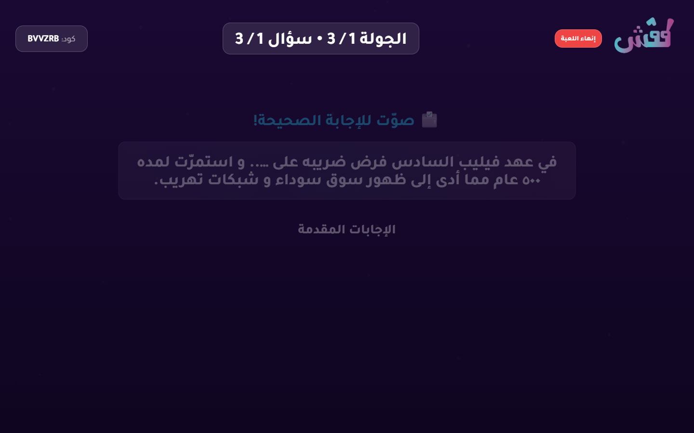
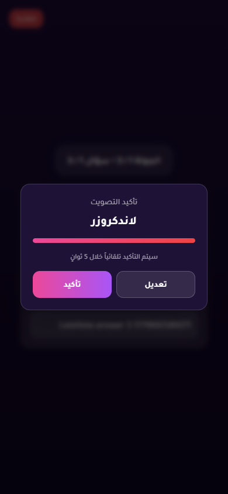
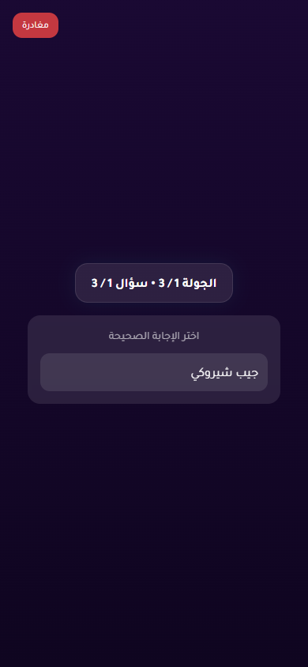
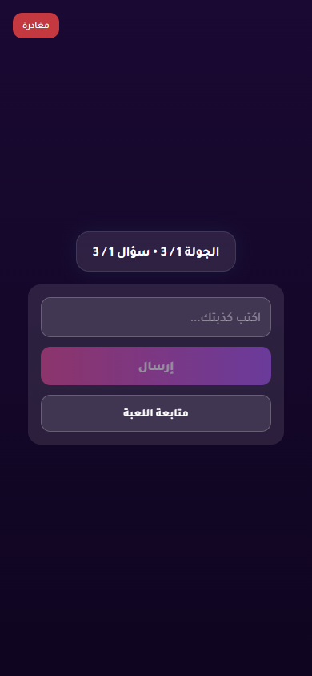
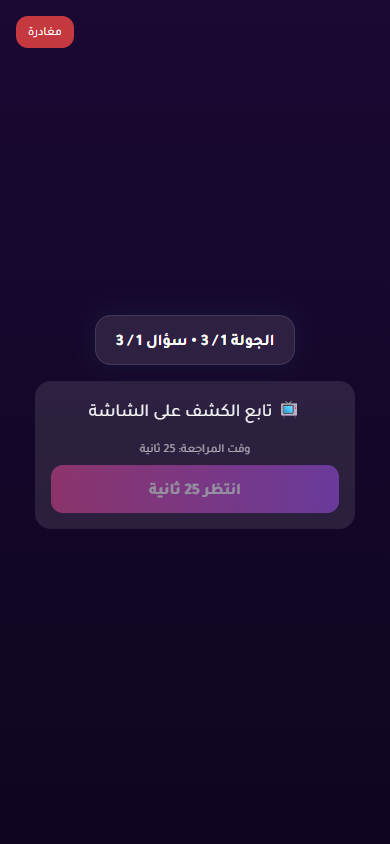
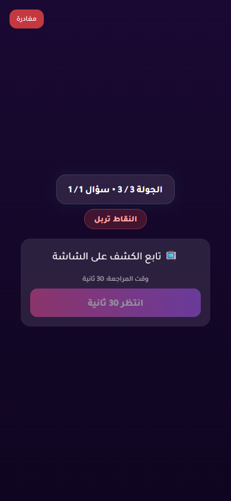
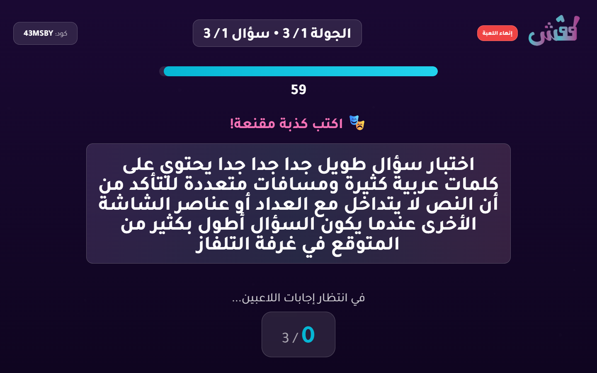
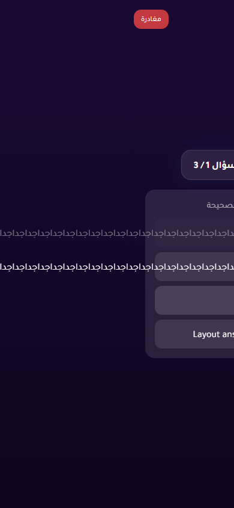

# Live Regression Battery Report

- Status: **FAIL**
- Target URL: https://fgsh-web.vercel.app
- Started: 2026-05-28T18:22:33.770Z
- Completed: 2026-05-28T18:34:47.812Z
- Credentials: supplied through environment variables and intentionally not logged.

## Cases

| Case | Status | Duration ms | Details |
| --- | --- | ---: | --- |
| Deterministic vote registration and scoring | PASS | 21145 | All 3 votes persisted exactly once and scores matched expected totals (VoteScore P01:500, VoteScore P02:500, VoteScore P03:1000). |
| Near-timeout selected vote must persist or clear cleanly | FAIL | 67514 | Reproduced vote UI mismatch: answer was visibly selected near timer zero, but no vote row persisted. |
| Answer timer reaches zero with active controller | PASS | 87023 | Answer timer reached zero with active controller and advanced to voting. |
| Answer timer reaches zero with frozen controller | PASS | 87080 | Frozen controller did not stall answer timer; round advanced to voting. |
| Answer timer with controller force-advance RPC blocked | FAIL | 87386 | Reproduced timer dependency: controller stayed connected but its force-advance RPC was blocked, another player was active, and the round remained answering after deadline. |
| Voting timer reaches zero with active controller | PASS | 73651 | Voting timer reached zero with active controller and advanced to completed. |
| Play Again leaver can rejoin same lobby | FAIL | 288474 | Reproduced Play Again leaver rejoin failure. Saved session present after leave: true. URL: https://fgsh-web.vercel.app/join?code=FJHCA4. Text: انضم إلى اللعبة الكود: FJHCA4 أدخل اسمك الاسم مستخدم بالفعل بدأ اللعبة العودة |
| Long question and answer text does not overlap or clip | FAIL | 21537 | Mobile answer overflow/clipping detected (button1 scroll=547x48 client=288x48; button2 scroll=547x48 client=288x48) |

## Diagnostics

- Console/page/request records captured: 143
- Relevant error records: 10

| Source | Type | Status | URL | Message |
| --- | --- | ---: | --- | --- |
| BlockedTimer P01 | requestfailed |  | https://yabticelgerjwzrhyaye.supabase.co/rest/v1/rpc/force_advance_round_as_player | net::ERR_FAILED |
| BlockedTimer P01 | console |  | https://fgsh-web.vercel.app/game | [error] Failed to load resource: net::ERR_FAILED |
| BlockedTimer P01 | console |  | https://fgsh-web.vercel.app/game | [error] Error calling force_advance_round: GameError: TypeError: Failed to fetch     at gt.forceAdvanceRound (https://fgsh-web.vercel.app/assets/index-f3ef173f.js:285:47934)     at async https://fgsh-web.vercel.app/assets/index-f3ef173f.js:374:37540 |
| Replay P02 | requestfailed |  | https://yabticelgerjwzrhyaye.supabase.co/rest/v1/games?select=*&id=eq.cd5834aa-e09f-40e0-b55c-890e116413bb | net::ERR_ABORTED |
| Replay P02 | requestfailed |  | https://yabticelgerjwzrhyaye.supabase.co/rest/v1/rpc/reconnect_player_session | net::ERR_ABORTED |
| Replay P02 | requestfailed |  | https://yabticelgerjwzrhyaye.supabase.co/rest/v1/player_answers?select=*%2Cplayer%3Aplayers%28*%29&round_id=eq.4facb441-b5e0-4c6f-915f-cfe61cef127e&order=submitted_at.asc%2Cid.asc | net::ERR_ABORTED |
| Replay P02 | console |  | https://fgsh-web.vercel.app/ | [error] [rehydrate] Failed to reconnect player: GameError: TypeError: Failed to fetch     at gt.reconnectPlayerSession (https://fgsh-web.vercel.app/assets/index-f3ef173f.js:285:47150)     at async rehydrateSession (https://fgsh-web.vercel.app/assets/index-f3ef173f.js:301:29507) |
| Replay P02 | console |  | https://fgsh-web.vercel.app/ | [error] ❌ SyncService: Sync failed for game cd5834aa-e09f-40e0-b55c-890e116413bb {message: TypeError: Failed to fetch, name: GameError, stack: GameError: TypeError: Failed to fetch     at Fr.fe…eb.vercel.app/assets/index-f3ef173f.js:285:69738)} |
| Replay P02 | console |  | https://fgsh-web.vercel.app/join?code=FJHCA4 | [error] Failed to load resource: the server responded with a status of 400 () |
| Replay P02 | console |  | https://fgsh-web.vercel.app/join?code=FJHCA4 | [error] Failed to join game: GameError: الاسم مستخدم بالفعل     at gt.joinGame (https://fgsh-web.vercel.app/assets/index-f3ef173f.js:285:44259)     at async joinGame (https://fgsh-web.vercel.app/assets/index-f3ef173f.js:301:17010)     at async f (https://fgsh-web.vercel.app/assets/index-f3ef173f.js:374:10025) |

## Blockers / Failures

- Near-timeout selected vote must persist or clear cleanly: Reproduced vote UI mismatch: answer was visibly selected near timer zero, but no vote row persisted.
- Answer timer with controller force-advance RPC blocked: Reproduced timer dependency: controller stayed connected but its force-advance RPC was blocked, another player was active, and the round remained answering after deadline.
- Play Again leaver can rejoin same lobby: Reproduced Play Again leaver rejoin failure. Saved session present after leave: true. URL: https://fgsh-web.vercel.app/join?code=FJHCA4. Text: انضم إلى اللعبة
الكود: FJHCA4
أدخل اسمك
الاسم مستخدم بالفعل
بدأ اللعبة
العودة
- Long question and answer text does not overlap or clip: Mobile answer overflow/clipping detected (button1 scroll=547x48 client=288x48; button2 scroll=547x48 client=288x48)

## Screenshots

Deterministic vote scoring reveal

Late vote selected before confirmation timeout

Active controller answer timer after zero

Frozen controller answer timer after zero

Blocked controller force-advance after answer timer zero

Active controller voting timer after zero

Replay case final round completed

Play Again leaver after pressing leave

Long TV question layout

Long mobile voting answer layout

