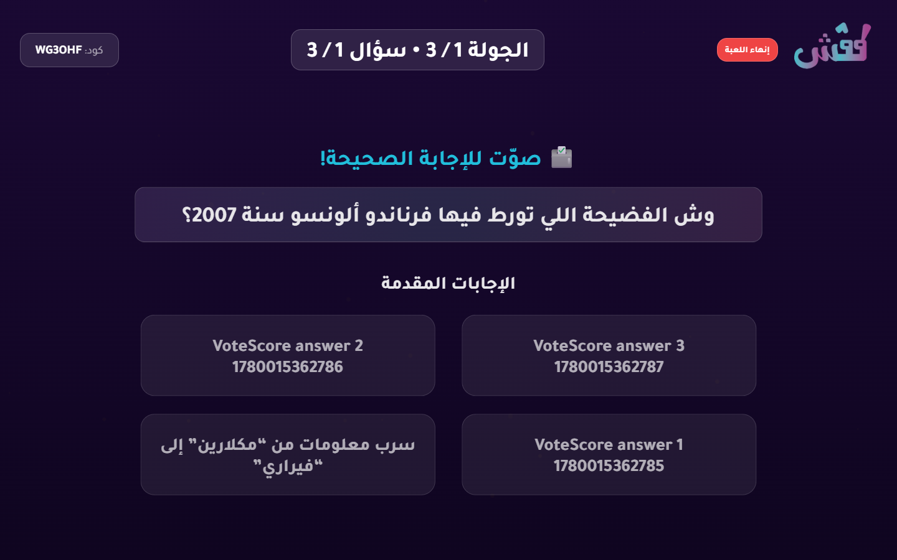
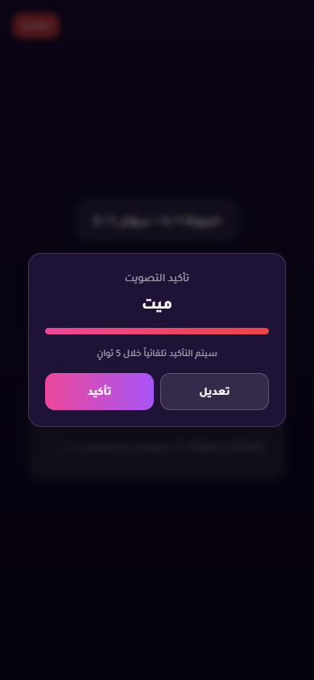
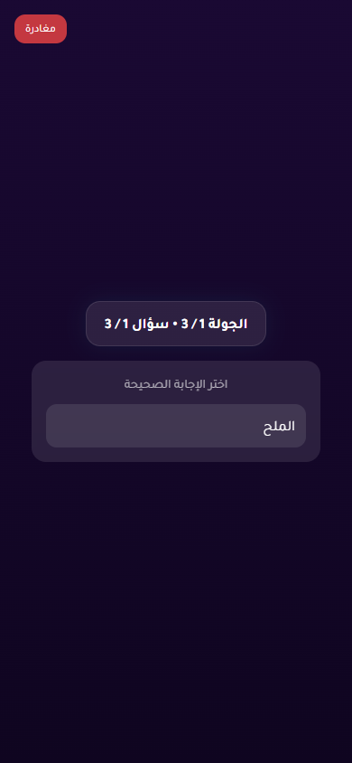
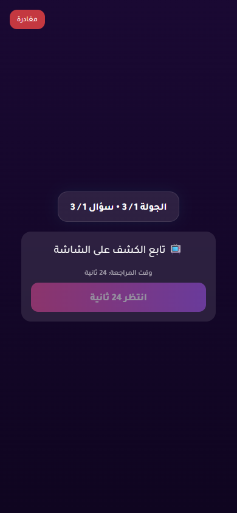
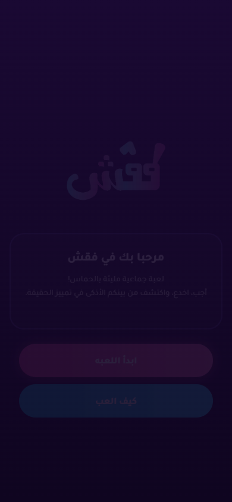
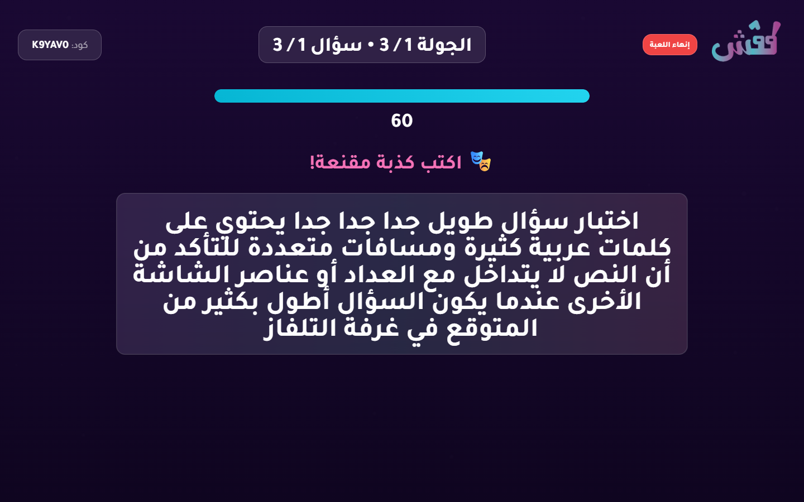
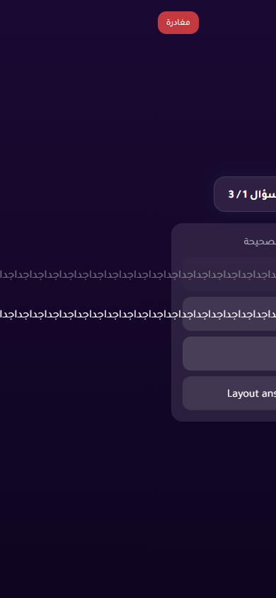

# Live Regression Battery Report

- Status: **FAIL**
- Target URL: http://127.0.0.1:5173
- Started: 2026-05-29T00:42:20.622Z
- Completed: 2026-05-29T00:54:07.689Z
- Credentials: supplied through environment variables and intentionally not logged.

## Cases

| Case | Status | Duration ms | Details |
| --- | --- | ---: | --- |
| Deterministic vote registration and scoring | PASS | 26170 | All 3 votes persisted exactly once and scores matched expected totals (VoteScore P01:500, VoteScore P02:500, VoteScore P03:1000). |
| Near-timeout selected vote must persist or clear cleanly | PASS | 64546 | No late vote persisted and no selected UI state was observed. |
| Answer timer reaches zero with active controller | PASS | 84044 | Answer timer reached zero with active controller and advanced to voting. |
| Answer timer reaches zero with frozen controller | PASS | 82774 | Frozen controller did not stall answer timer; round advanced to voting. |
| Answer timer with controller force-advance RPC blocked | PASS | 82422 | Blocked controller force-advance did not stall the timer; round advanced to voting. |
| Voting timer reaches zero with active controller | PASS | 70609 | Voting timer reached zero with active controller and advanced to completed. |
| Play Again leaver can rejoin same lobby | FAIL | 281974 | Reproduced Play Again leaver rejoin failure. Saved session present after leave: false. URL: http://127.0.0.1:5173/join?code=OJ8QY9. Text: انضم إلى اللعبة الكود: OJ8QY9 أدخل اسمك الاسم مستخدم بالفعل بدأ اللعبة العودة |
| Long question and answer text does not overlap or clip | FAIL | 14210 | Mobile answer overflow/clipping detected (button1 scroll=547x48 client=288x48; button2 scroll=547x48 client=288x48) |

## Diagnostics

- Console/page/request records captured: 206
- Relevant error records: 35

| Source | Type | Status | URL | Message |
| --- | --- | ---: | --- | --- |
| VoteScore TV | requestfailed |  | https://fonts.googleapis.com/css2?family=Tajawal:wght@400;500;700;800&display=swap | net::ERR_ABORTED |
| VoteScore TV | console |  | http://127.0.0.1:5173/create | [error] Failed to load resource: the server responded with a status of 404 (Not Found) |
| VoteScore TV | console |  | http://127.0.0.1:5173/tv/game | [error] Failed to load resource: the server responded with a status of 404 (Not Found) |
| LateVote TV | requestfailed |  | https://fonts.googleapis.com/css2?family=Tajawal:wght@400;500;700;800&display=swap | net::ERR_ABORTED |
| LateVote TV | console |  | http://127.0.0.1:5173/tv/game | [error] Failed to load resource: the server responded with a status of 404 (Not Found) |
| LateVote P02 | console |  | http://127.0.0.1:5173/game | [error] Failed to load resource: the server responded with a status of 404 (Not Found) |
| LateVote P01 | console |  | http://127.0.0.1:5173/game | [error] Failed to load resource: the server responded with a status of 404 (Not Found) |
| LateVote P03 | console |  | http://127.0.0.1:5173/game | [error] Failed to load resource: the server responded with a status of 404 (Not Found) |
| AnswerZero TV | requestfailed |  | https://fonts.googleapis.com/css2?family=Tajawal:wght@400;500;700;800&display=swap | net::ERR_ABORTED |
| AnswerZero TV | console |  | http://127.0.0.1:5173/tv/game | [error] Failed to load resource: the server responded with a status of 404 (Not Found) |
| AnswerZero P01 | console |  | http://127.0.0.1:5173/game | [error] Failed to load resource: the server responded with a status of 404 (Not Found) |
| AnswerZero P02 | console |  | http://127.0.0.1:5173/game | [error] Failed to load resource: the server responded with a status of 404 (Not Found) |
| FrozenHost TV | requestfailed |  | https://fonts.googleapis.com/css2?family=Tajawal:wght@400;500;700;800&display=swap | net::ERR_ABORTED |
| FrozenHost TV | console |  | http://127.0.0.1:5173/tv/game | [error] Failed to load resource: the server responded with a status of 404 (Not Found) |
| FrozenHost P01 | console |  | http://127.0.0.1:5173/game | [error] Failed to load resource: the server responded with a status of 404 (Not Found) |
| FrozenHost P02 | console |  | http://127.0.0.1:5173/game | [error] Failed to load resource: the server responded with a status of 404 (Not Found) |
| BlockedTimer TV | requestfailed |  | https://fonts.googleapis.com/css2?family=Tajawal:wght@400;500;700;800&display=swap | net::ERR_ABORTED |
| BlockedTimer TV | console |  | http://127.0.0.1:5173/tv/game | [error] Failed to load resource: the server responded with a status of 404 (Not Found) |
| BlockedTimer P01 | console |  | http://127.0.0.1:5173/game | [error] Failed to load resource: the server responded with a status of 404 (Not Found) |
| BlockedTimer P02 | console |  | http://127.0.0.1:5173/game | [error] Failed to load resource: the server responded with a status of 404 (Not Found) |
| BlockedTimer P01 | requestfailed |  | https://yabticelgerjwzrhyaye.supabase.co/rest/v1/rpc/force_advance_round_as_player | net::ERR_FAILED |
| BlockedTimer P01 | console |  | http://127.0.0.1:5173/game | [error] Failed to load resource: net::ERR_FAILED |
| BlockedTimer P01 | console |  | http://127.0.0.1:5173/game | [error] Error calling force_advance_round: GameError: TypeError: Failed to fetch     at GameService.forceAdvanceRound (http://127.0.0.1:5173/@fs/C:/Users/Hopef/Desktop/Fgsh/packages/shared/src/services/GameService.ts:413:13)     at async handleTimerExpired (http://127.0.0.1:5173/src/pages/Game.tsx:603:11) |
| VoteZero TV | requestfailed |  | https://fonts.googleapis.com/css2?family=Tajawal:wght@400;500;700;800&display=swap | net::ERR_ABORTED |
| VoteZero TV | console |  | http://127.0.0.1:5173/tv/game | [error] Failed to load resource: the server responded with a status of 404 (Not Found) |
| VoteZero P01 | console |  | http://127.0.0.1:5173/game | [error] Failed to load resource: the server responded with a status of 404 (Not Found) |
| VoteZero P03 | console |  | http://127.0.0.1:5173/game | [error] Failed to load resource: the server responded with a status of 404 (Not Found) |
| VoteZero P02 | console |  | http://127.0.0.1:5173/game | [error] Failed to load resource: the server responded with a status of 404 (Not Found) |
| Replay TV | requestfailed |  | https://fonts.googleapis.com/css2?family=Tajawal:wght@400;500;700;800&display=swap | net::ERR_ABORTED |
| Replay TV | console |  | http://127.0.0.1:5173/tv/game | [error] Failed to load resource: the server responded with a status of 404 (Not Found) |
| Replay P02 | console |  | http://127.0.0.1:5173/ | [error] [rehydrate] Failed to reconnect player: GameError: Player session expired     at GameService.getPlayerSession (http://127.0.0.1:5173/@fs/C:/Users/Hopef/Desktop/Fgsh/packages/shared/src/services/GameService.ts:34:13)     at GameService.reconnectPlayerSession (http://127.0.0.1:5173/@fs/C:/Users/Hopef/Desktop/Fgsh/packages/shared/src/services/GameService.ts:370:26)     at rehydrateSession (http://127.0.0.1:5173/@fs/C:/Users/Hopef/Desktop/Fgsh/packages/shared/src/stores/gameStore.ts:1199:53) |
| Replay P02 | console |  | http://127.0.0.1:5173/join?code=OJ8QY9 | [error] Failed to load resource: the server responded with a status of 400 () |
| Replay P02 | console |  | http://127.0.0.1:5173/join?code=OJ8QY9 | [error] Failed to join game: GameError: الاسم مستخدم بالفعل     at GameService.joinGame (http://127.0.0.1:5173/@fs/C:/Users/Hopef/Desktop/Fgsh/packages/shared/src/services/GameService.ts:215:15)     at async joinGame (http://127.0.0.1:5173/@fs/C:/Users/Hopef/Desktop/Fgsh/packages/shared/src/stores/gameStore.ts:663:45)     at async handleJoinGame (http://127.0.0.1:5173/src/pages/JoinGame.tsx:58:7) |
| Layout TV | requestfailed |  | https://fonts.googleapis.com/css2?family=Tajawal:wght@400;500;700;800&display=swap | net::ERR_ABORTED |
| Layout TV | console |  | http://127.0.0.1:5173/tv/game | [error] Failed to load resource: the server responded with a status of 404 (Not Found) |

## Blockers / Failures

- Play Again leaver can rejoin same lobby: Reproduced Play Again leaver rejoin failure. Saved session present after leave: false. URL: http://127.0.0.1:5173/join?code=OJ8QY9. Text: انضم إلى اللعبة
الكود: OJ8QY9
أدخل اسمك
الاسم مستخدم بالفعل
بدأ اللعبة
العودة
- Long question and answer text does not overlap or clip: Mobile answer overflow/clipping detected (button1 scroll=547x48 client=288x48; button2 scroll=547x48 client=288x48)

## Screenshots

Deterministic vote scoring reveal

Late vote selected before confirmation timeout

Active controller answer timer after zero

Frozen controller answer timer after zero

Blocked controller force-advance after answer timer zero

Active controller voting timer after zero

Replay case final round completed

Play Again leaver after pressing leave

Long TV question layout

Long mobile voting answer layout

