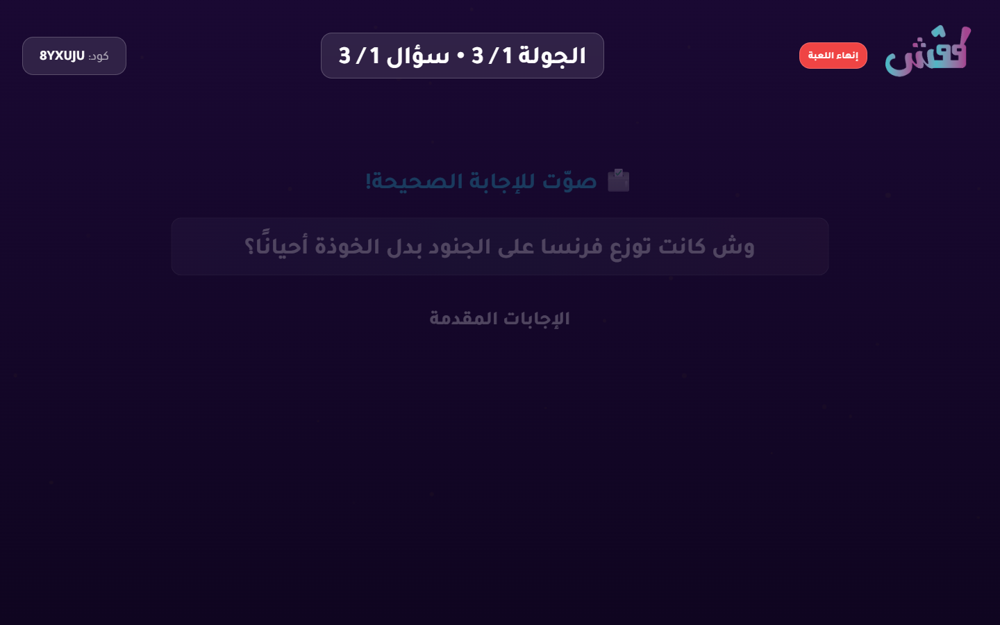
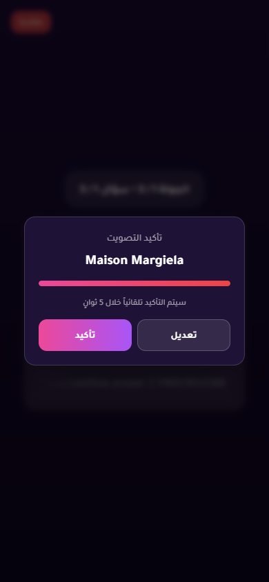
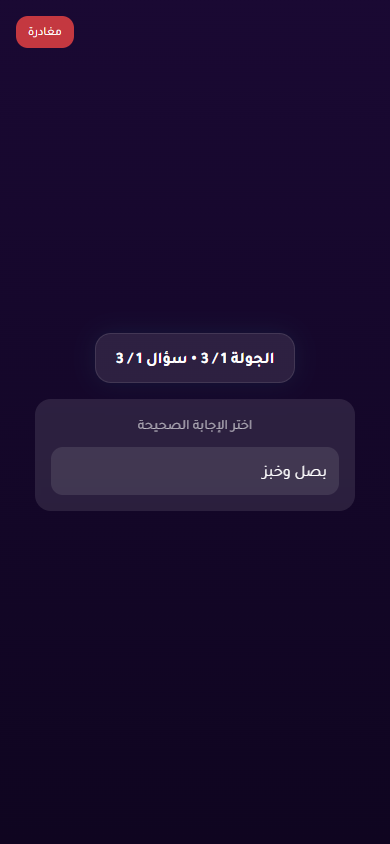
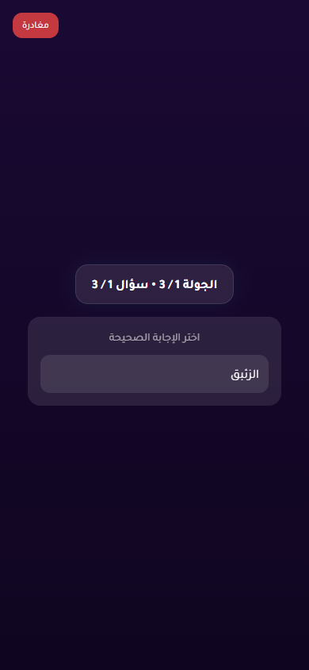
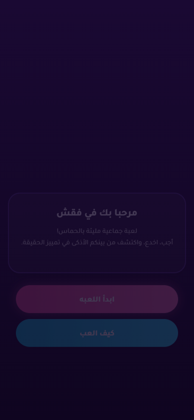
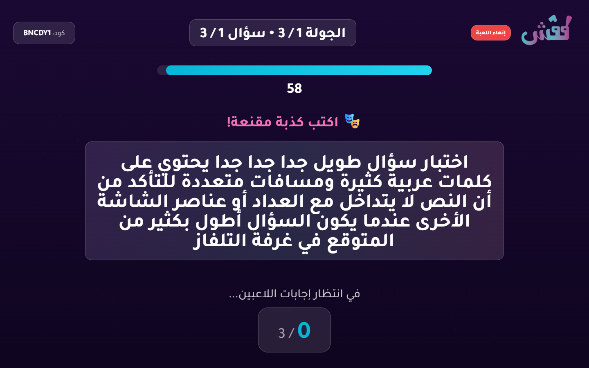
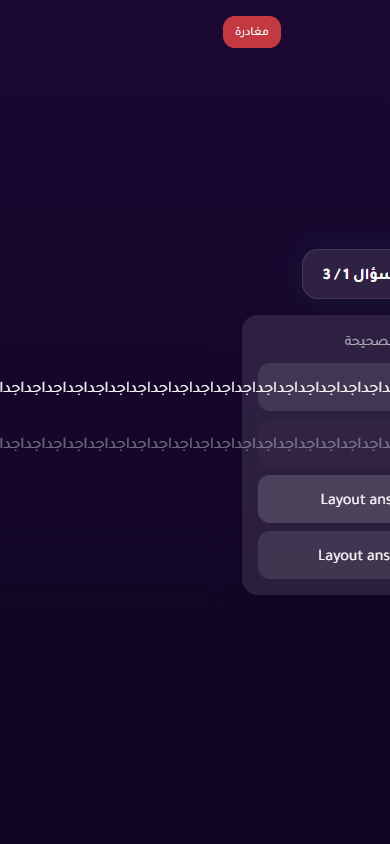

# Live Regression Battery Report

- Status: **FAIL**
- Target URL: https://fgsh-web.vercel.app
- Started: 2026-06-04T13:01:19.912Z
- Completed: 2026-06-04T13:13:23.650Z
- Credentials: supplied through environment variables and intentionally not logged.

## Cases

| Case | Status | Duration ms | Details |
| --- | --- | ---: | --- |
| Deterministic vote registration and scoring | PASS | 26510 | All 3 votes persisted exactly once and scores matched expected totals (VoteScore P01:500, VoteScore P03:1000, VoteScore P02:500). |
| Near-timeout selected vote must persist or clear cleanly | PASS | 68300 | No late vote persisted and no selected UI state was observed. |
| Answer timer reaches zero with active controller | PASS | 86284 | Answer timer reached zero with active controller and advanced to voting. |
| Answer timer reaches zero with frozen controller | PASS | 86806 | Frozen controller did not stall answer timer; round advanced to voting. |
| Answer timer with controller force-advance RPC blocked | PASS | 85908 | Blocked controller force-advance did not stall the timer; round advanced to voting. |
| Voting timer reaches zero with active controller | PASS | 72875 | Voting timer reached zero with active controller and advanced to completed. |
| Play Again leaver can rejoin same lobby | PASS | 275851 | Leaver rejoined the restarted lobby successfully. Saved session present after leave: false. |
| Long question and answer text does not overlap or clip | FAIL | 20944 | Mobile answer overflow/clipping detected (button1 scroll=547x48 client=288x48; button2 scroll=547x48 client=288x48) |

## Diagnostics

- Console/page/request records captured: 142
- Relevant error records: 3

| Source | Type | Status | URL | Message |
| --- | --- | ---: | --- | --- |
| BlockedTimer P01 | requestfailed |  | https://yabticelgerjwzrhyaye.supabase.co/rest/v1/rpc/force_advance_round_as_player | net::ERR_FAILED |
| BlockedTimer P01 | console |  | https://fgsh-web.vercel.app/game | [error] Failed to load resource: net::ERR_FAILED |
| BlockedTimer P01 | console |  | https://fgsh-web.vercel.app/game | [error] Error calling force_advance_round: GameError: TypeError: Failed to fetch     at vt.forceAdvanceRound (https://fgsh-web.vercel.app/assets/index-b14bacc7.js:285:47934)     at async ne (https://fgsh-web.vercel.app/assets/index-b14bacc7.js:374:37700) |

## Blockers / Failures

- Long question and answer text does not overlap or clip: Mobile answer overflow/clipping detected (button1 scroll=547x48 client=288x48; button2 scroll=547x48 client=288x48)

## Screenshots

Deterministic vote scoring reveal

Late vote selected before confirmation timeout

Active controller answer timer after zero

Frozen controller answer timer after zero

Blocked controller force-advance after answer timer zero

Active controller voting timer after zero

Replay case final round completed

Play Again leaver after pressing leave

Long TV question layout

Long mobile voting answer layout

