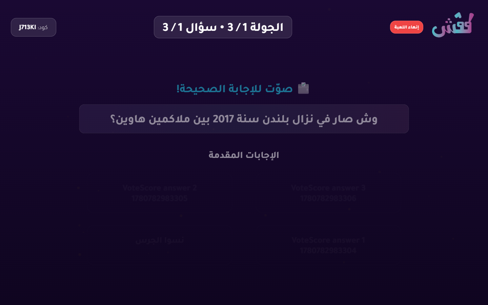

# Live Regression Battery Report

- Status: **PASS**
- Target URL: https://fgsh-web.vercel.app
- Started: 2026-06-06T21:56:08.582Z
- Completed: 2026-06-06T21:56:27.500Z
- Credentials: supplied through environment variables and intentionally not logged.

## Cases

| Case | Status | Duration ms | Details |
| --- | --- | ---: | --- |
| Deterministic vote registration and scoring | PASS | 18733 | All 3 votes persisted exactly once and scores matched expected totals (VoteScore P01:500, VoteScore P03:1000, VoteScore P02:500). |

## Diagnostics

- Console/page/request records captured: 10
- Relevant error records: 0

_No relevant framework/runtime errors were recorded._

## Blockers / Failures

_No blockers recorded._

## Screenshots

Deterministic vote scoring reveal

