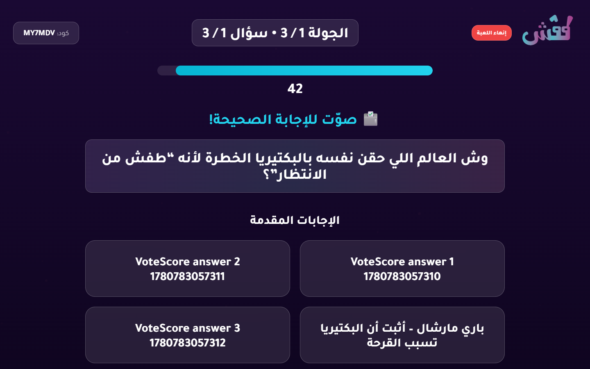

# Live Regression Battery Report

- Status: **PASS**
- Target URL: https://fgsh-web.vercel.app
- Started: 2026-06-06T21:57:22.626Z
- Completed: 2026-06-06T21:57:41.540Z
- Credentials: supplied through environment variables and intentionally not logged.

## Cases

| Case | Status | Duration ms | Details |
| --- | --- | ---: | --- |
| Deterministic vote registration and scoring | PASS | 18727 | All 3 votes persisted exactly once, vote points matched, and scores matched expected totals (VoteScore P01:500, VoteScore P03:1000, VoteScore P02:500; vote points 85abae0f-86b7-459d-8500-f74053cae897:0, eea92647-47f8-44d5-9e50-c0f9958fdcf5:0, e6818760-5ed4-417a-b50a-372c68d7071a:1000). |

## Diagnostics

- Console/page/request records captured: 10
- Relevant error records: 0

_No relevant framework/runtime errors were recorded._

## Blockers / Failures

_No blockers recorded._

## Screenshots

Deterministic vote scoring reveal

