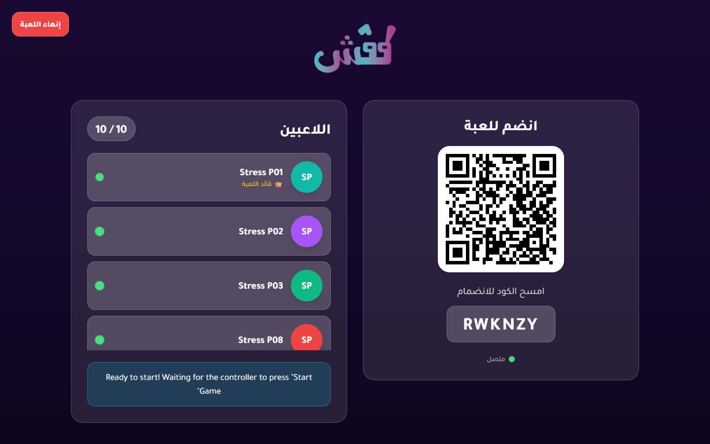
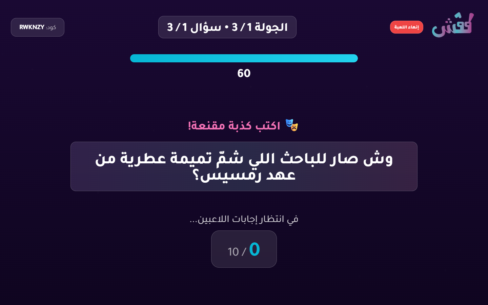
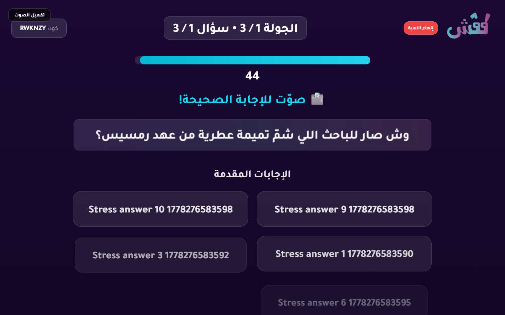
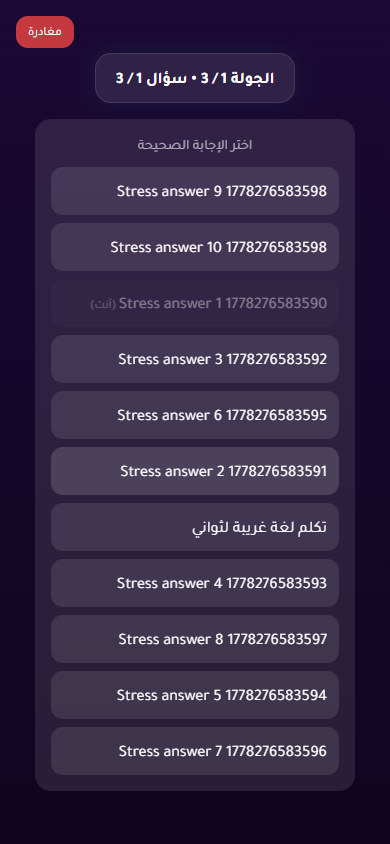
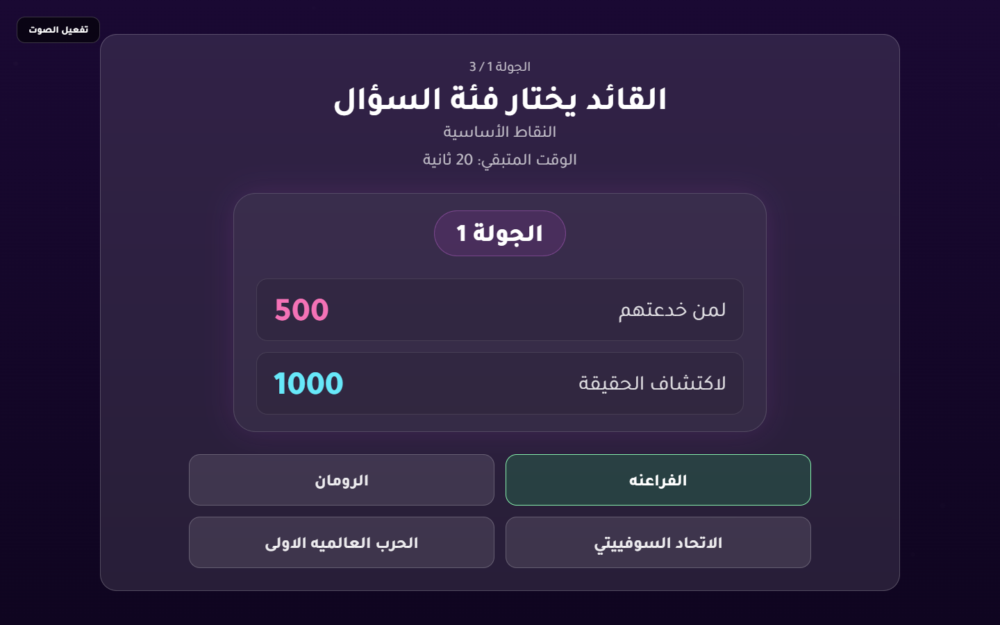
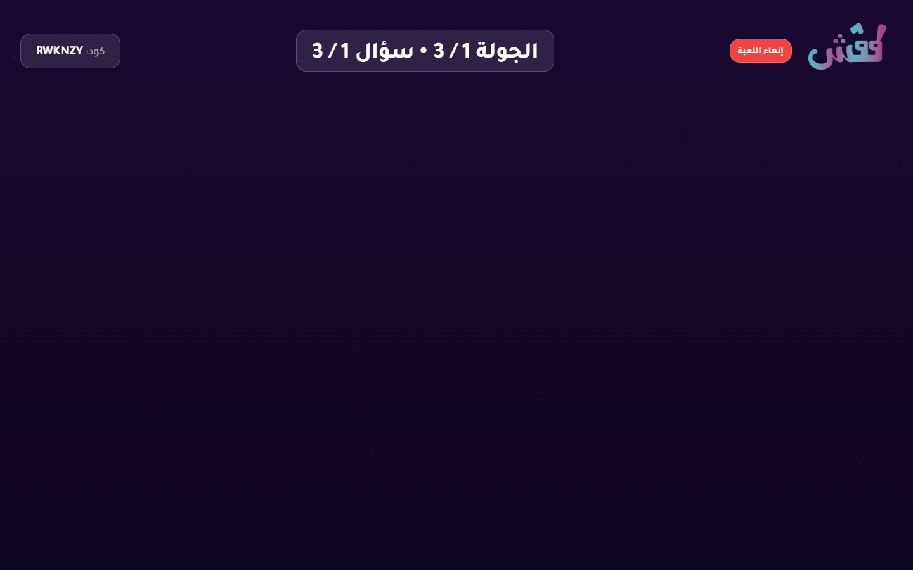
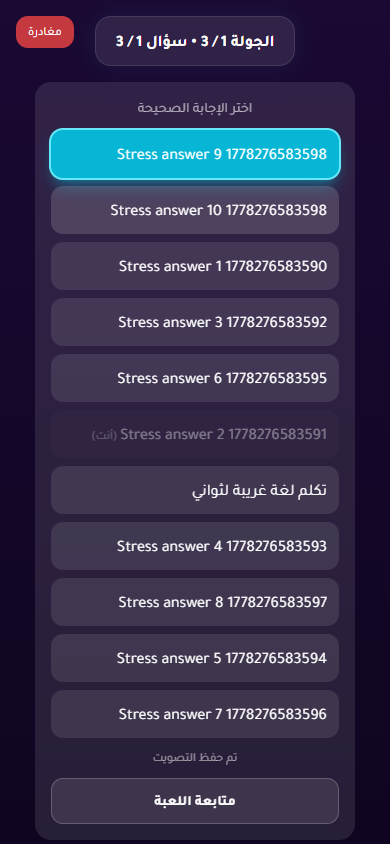

# 10-Player Stress Test Report

- Status: **FAIL**
- Target URL: https://fgsh-web.vercel.app
- Started: 2026-05-08T21:42:27.385Z
- Completed: 2026-05-08T21:44:26.225Z
- Browser: chromium
- Viewports: TV/host 1440x900; players 390x844 in 10 isolated contexts
- Credentials: supplied through environment variables and intentionally not logged.
- Game code: RWKNZY

## Acceptance Criteria

| Criterion | Status | Details |
| --- | --- | --- |
| Required environment variables are present | PASS | All required env vars are set. |
| Host can log in and create a TV room | PASS | Created TV room RWKNZY. |
| 10 players join successfully | PASS | 10 players joined isolated browser contexts. |
| TV lobby displays 10 / 10 players | PASS | TV lobby displayed 10 / 10 players. |
| Game starts for TV and players | PASS | TV and player pages reached the first answering state. |
| All 10 answers confirm | PASS | All 10 player answer confirmations completed. |
| Voting opens for all players | PASS | Voting options appeared for all 10 players. |
| All 10 votes confirm | PASS | All 10 player vote confirmations completed. |
| Round reaches completed/reveal state | PASS | Voting options disappeared after completion, and completed/reveal screenshots were captured. |
| No unexpected TV category-selection flash after answering begins | FAIL | 1 unexpected TV category-selection wait sample(s) observed after answering began. |
| No relevant framework/runtime errors | FAIL | 11 relevant diagnostic records were captured. |

## Timings

| Phase | Actor | Duration ms | Status | Details |
| --- | --- | ---: | --- | --- |
| create room | host | 3490 | PASS | Created TV room RWKNZY. |
| join | Stress P01 | 2732 | PASS |  |
| join | Stress P02 | 2610 | PASS |  |
| join | Stress P03 | 2638 | PASS |  |
| join | Stress P08 | 2679 | PASS |  |
| join | Stress P10 | 2672 | PASS |  |
| join | Stress P09 | 2742 | PASS |  |
| join | Stress P04 | 2838 | PASS |  |
| join | Stress P07 | 2836 | PASS |  |
| join | Stress P05 | 2853 | PASS |  |
| join | Stress P06 | 2855 | PASS |  |
| start game | Stress P01 | 25071 | PASS |  |
| answer | Stress P10 | 172 | PASS |  |
| answer | Stress P08 | 174 | PASS |  |
| answer | Stress P06 | 177 | PASS |  |
| answer | Stress P07 | 178 | PASS |  |
| answer | Stress P03 | 183 | PASS |  |
| answer | Stress P02 | 184 | PASS |  |
| answer | Stress P09 | 178 | PASS |  |
| answer | Stress P04 | 184 | PASS |  |
| answer | Stress P05 | 199 | PASS |  |
| answer | Stress P01 | 204 | PASS |  |
| vote | Stress P01 | 118 | PASS |  |
| vote | Stress P02 | 167 | PASS |  |
| vote | Stress P08 | 175 | PASS |  |
| vote | Stress P09 | 182 | PASS |  |
| vote | Stress P03 | 188 | PASS |  |
| vote | Stress P06 | 191 | PASS |  |
| vote | Stress P07 | 191 | PASS |  |
| vote | Stress P10 | 190 | PASS |  |
| vote | Stress P04 | 197 | PASS |  |
| vote | Stress P05 | 197 | PASS |  |
| total | all | 118672 | FAIL |  |
| total | all | 118839 | FAIL | stress-test acceptance status  expect(received).toBe(expected) // Object.is equality  Expected: "pass" Received: "fail" |

## Diagnostics

- Console/page/request records captured: 303
- Relevant error records: 11

| Source | Type | Status | URL | Message |
| --- | --- | ---: | --- | --- |
| Stress P09 | console |  | https://fgsh-web.vercel.app/game | [error] The AudioContext encountered an error from the audio device or the WebAudio renderer. |
| Stress P01 | console |  | https://fgsh-web.vercel.app/game | [error] The AudioContext encountered an error from the audio device or the WebAudio renderer. |
| Stress P02 | console |  | https://fgsh-web.vercel.app/game | [error] The AudioContext encountered an error from the audio device or the WebAudio renderer. |
| Stress P03 | console |  | https://fgsh-web.vercel.app/game | [error] The AudioContext encountered an error from the audio device or the WebAudio renderer. |
| TV/host | console |  | https://fgsh-web.vercel.app/tv/game | [error] The AudioContext encountered an error from the audio device or the WebAudio renderer. |
| Stress P06 | console |  | https://fgsh-web.vercel.app/game | [error] The AudioContext encountered an error from the audio device or the WebAudio renderer. |
| Stress P10 | console |  | https://fgsh-web.vercel.app/game | [error] The AudioContext encountered an error from the audio device or the WebAudio renderer. |
| Stress P04 | console |  | https://fgsh-web.vercel.app/game | [error] The AudioContext encountered an error from the audio device or the WebAudio renderer. |
| Stress P07 | console |  | https://fgsh-web.vercel.app/game | [error] The AudioContext encountered an error from the audio device or the WebAudio renderer. |
| Stress P05 | console |  | https://fgsh-web.vercel.app/game | [error] The AudioContext encountered an error from the audio device or the WebAudio renderer. |
| Stress P08 | console |  | https://fgsh-web.vercel.app/game | [error] The AudioContext encountered an error from the audio device or the WebAudio renderer. |

## Failure / Blockers

- Unexpected TV category-selection wait screen appeared after answering began.
- stress-test acceptance status

expect(received).toBe(expected) // Object.is equality

Expected: "pass"
Received: "fail"

## Screenshots

TV lobby with 10 players

TV answering state

Player answering state

TV voting state

Player voting state

Unexpected TV category-selection flash

TV completed/reveal state

Player completed state

Failure state - TV/host

Failure state - Stress P01

Failure state - Stress P02

