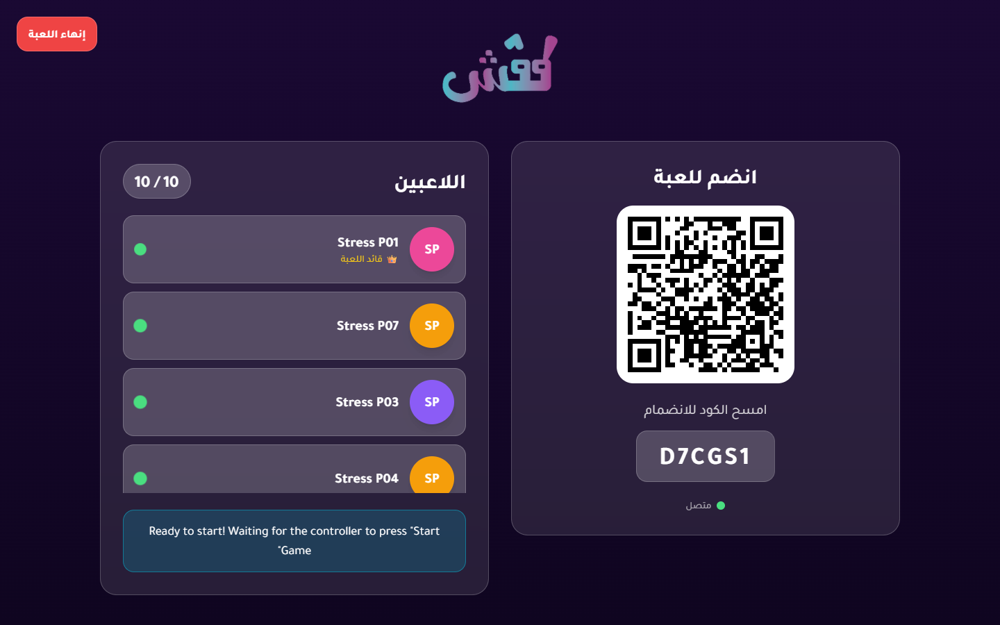
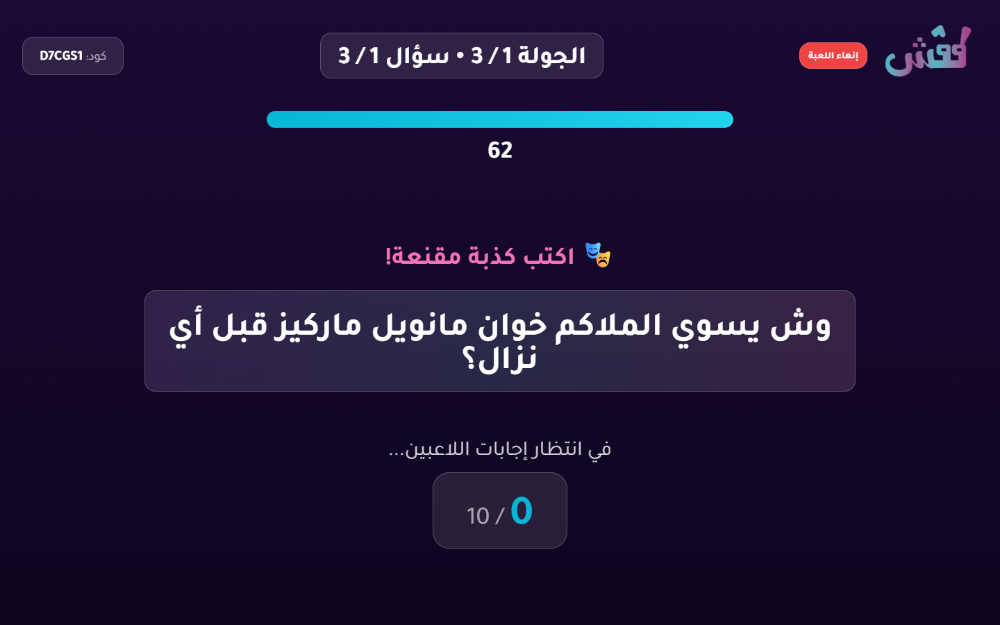
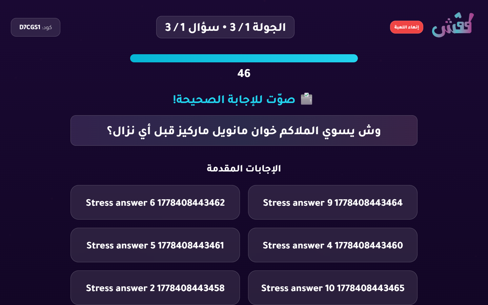
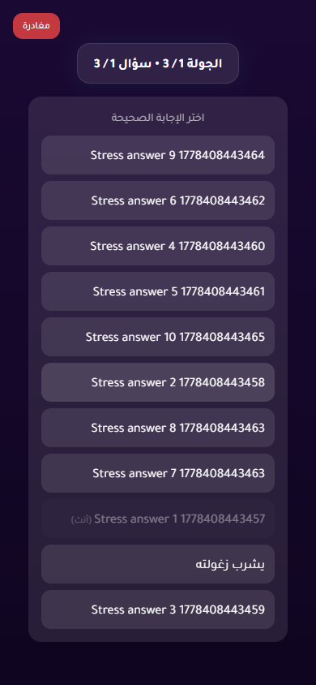
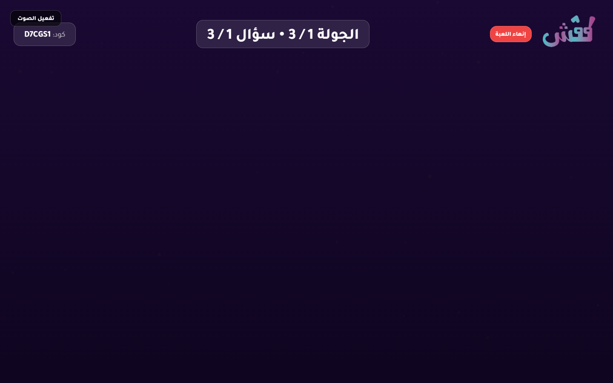
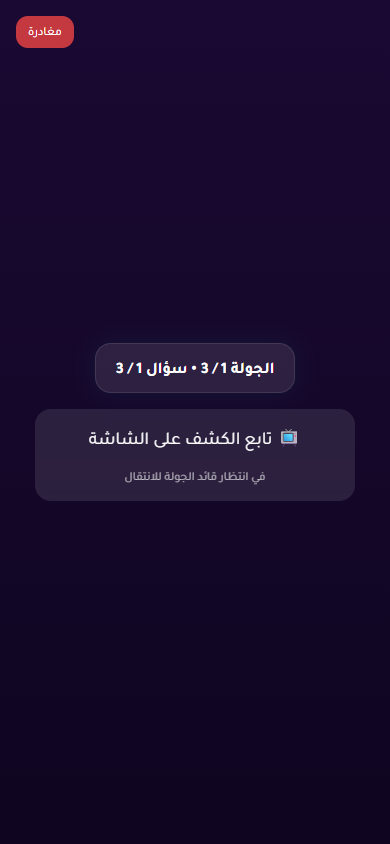

# 10-Player Stress Test Report

- Status: **FAIL**
- Target URL: https://fgsh-web.vercel.app
- Started: 2026-05-10T10:20:06.503Z
- Completed: 2026-05-10T10:21:35.528Z
- Browser: chromium
- Viewports: TV/host 1440x900; players 390x844 in 10 isolated contexts
- Credentials: supplied through environment variables and intentionally not logged.
- Game code: D7CGS1

## Acceptance Criteria

| Criterion | Status | Details |
| --- | --- | --- |
| Required environment variables are present | PASS | All required env vars are set. |
| Host can log in and create a TV room | PASS | Created TV room D7CGS1. |
| 10 players join successfully | PASS | 10 players joined isolated browser contexts. |
| TV lobby displays 10 / 10 players | PASS | TV lobby displayed 10 / 10 players. |
| Game starts for TV and players | PASS | TV and player pages reached the first answering state. |
| All 10 answers confirm | PASS | All 10 player answer confirmations completed. |
| Voting opens for all players | PASS | Voting options appeared for all 10 players. |
| All 10 votes confirm | PASS | All 10 player vote confirmations completed. |
| Round reaches completed/reveal state | PASS | Voting options disappeared after completion, and completed/reveal screenshots were captured. |
| No unexpected TV category-selection flash after answering begins | FAIL | 1 unexpected TV category-selection wait sample(s) observed after answering began. |
| No relevant framework/runtime errors | PASS | No relevant runtime, page, request, or HTTP 5xx errors were captured. |

## Timings

| Phase | Actor | Duration ms | Status | Details |
| --- | --- | ---: | --- | --- |
| create room | host | 3887 | PASS | Created TV room D7CGS1. |
| join | Stress P01 | 2433 | PASS |  |
| join | Stress P07 | 2384 | PASS |  |
| join | Stress P03 | 2558 | PASS |  |
| join | Stress P09 | 2607 | PASS |  |
| join | Stress P02 | 2730 | PASS |  |
| join | Stress P08 | 2753 | PASS |  |
| join | Stress P04 | 2860 | PASS |  |
| join | Stress P06 | 3014 | PASS |  |
| join | Stress P05 | 3075 | PASS |  |
| join | Stress P10 | 3133 | PASS |  |
| start game | Stress P01 | 25239 | PASS |  |
| answer | Stress P08 | 160 | PASS |  |
| answer | Stress P07 | 161 | PASS |  |
| answer | Stress P02 | 167 | PASS |  |
| answer | Stress P04 | 166 | PASS |  |
| answer | Stress P05 | 166 | PASS |  |
| answer | Stress P03 | 169 | PASS |  |
| answer | Stress P06 | 168 | PASS |  |
| answer | Stress P10 | 166 | PASS |  |
| answer | Stress P09 | 168 | PASS |  |
| answer | Stress P01 | 183 | PASS |  |
| vote | Stress P03 | 71 | PASS |  |
| vote | Stress P06 | 134 | PASS |  |
| vote | Stress P05 | 137 | PASS |  |
| vote | Stress P08 | 136 | PASS |  |
| vote | Stress P04 | 138 | PASS |  |
| vote | Stress P10 | 136 | PASS |  |
| vote | Stress P02 | 165 | PASS |  |
| vote | Stress P09 | 161 | PASS |  |
| vote | Stress P01 | 168 | PASS |  |
| vote | Stress P07 | 165 | PASS |  |
| total | all | 88876 | PASS |  |
| total | all | 89024 | FAIL | stress-test acceptance status  expect(received).toBe(expected) // Object.is equality  Expected: "pass" Received: "fail" |

## Diagnostics

- Console/page/request records captured: 283
- Relevant error records: 0

_No relevant framework/runtime errors were recorded._

## Failure / Blockers

- Unexpected TV category-selection wait screen appeared after answering began.
- stress-test acceptance status

expect(received).toBe(expected) // Object.is equality

Expected: "pass"
Received: "fail"

## Screenshots

TV lobby with 10 players

TV answering state

Player answering state

TV voting state

Player voting state

Unexpected TV category-selection flash

TV completed/reveal state

Player completed state

Failure state - TV/host

Failure state - Stress P01

Failure state - Stress P02

