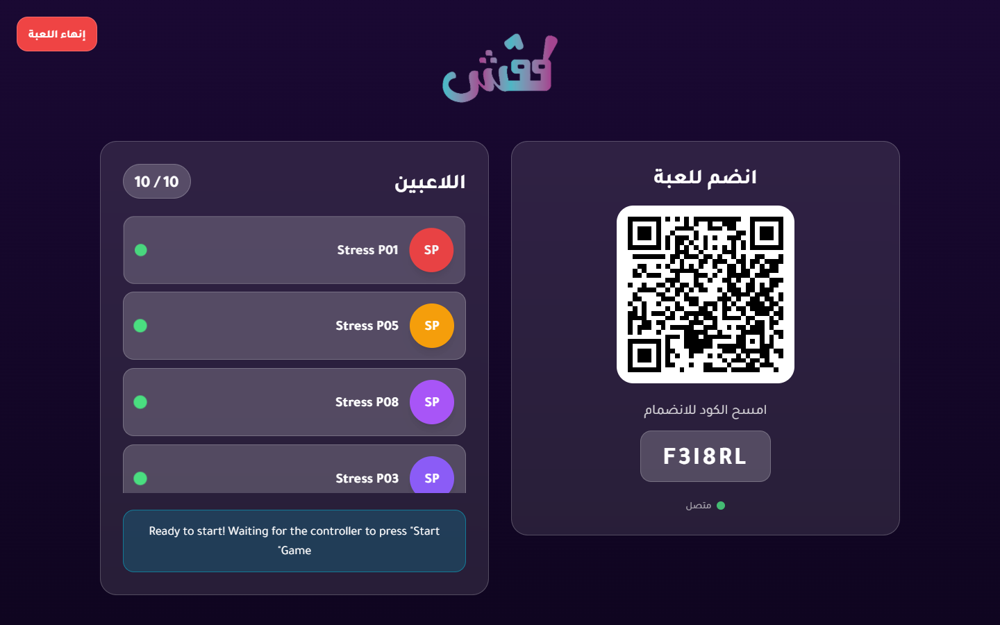
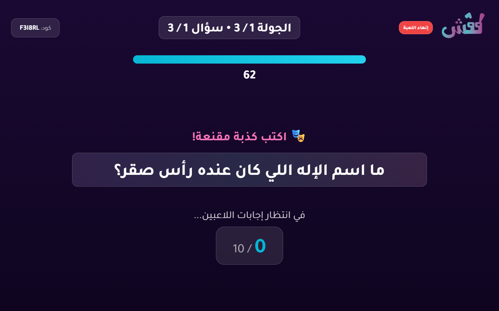
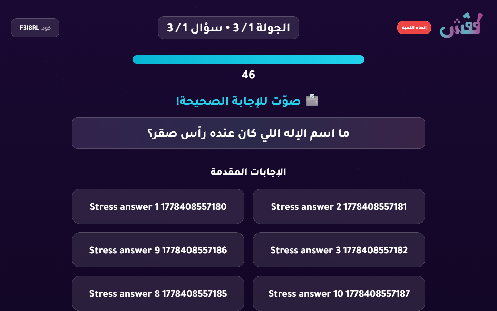
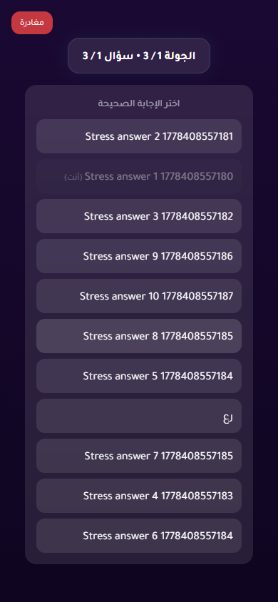
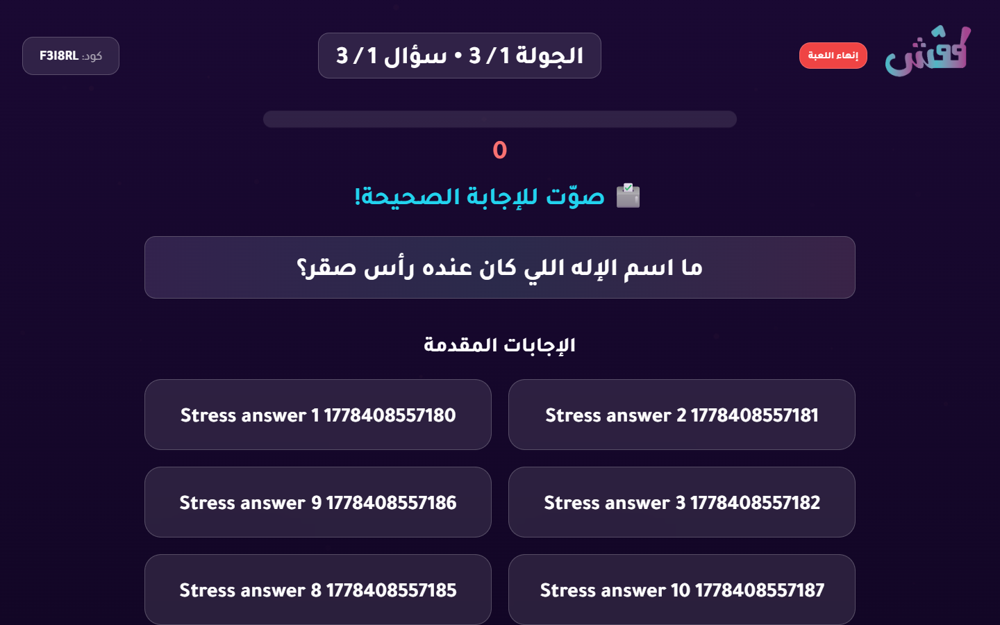

# 10-Player Stress Test Report

- Status: **PASS**
- Target URL: https://fgsh-web.vercel.app
- Started: 2026-05-10T10:22:01.465Z
- Completed: 2026-05-10T10:23:28.089Z
- Browser: chromium
- Viewports: TV/host 1440x900; players 390x844 in 10 isolated contexts
- Credentials: supplied through environment variables and intentionally not logged.
- Game code: F3I8RL

## Acceptance Criteria

| Criterion | Status | Details |
| --- | --- | --- |
| Required environment variables are present | PASS | All required env vars are set. |
| Host can log in and create a TV room | PASS | Created TV room F3I8RL. |
| 10 players join successfully | PASS | 10 players joined isolated browser contexts. |
| TV lobby displays 10 / 10 players | PASS | TV lobby displayed 10 / 10 players. |
| Game starts for TV and players | PASS | TV and player pages reached the first answering state. |
| All 10 answers confirm | PASS | All 10 player answer confirmations completed. |
| Voting opens for all players | PASS | Voting options appeared for all 10 players. |
| All 10 votes confirm | PASS | All 10 player vote confirmations completed. |
| Round reaches completed/reveal state | PASS | Voting options disappeared after completion, and completed/reveal screenshots were captured. |
| No unexpected TV category-selection flash after answering begins | PASS | No TV category-selection wait screen was observed after answering began. |
| No relevant framework/runtime errors | PASS | No relevant runtime, page, request, or HTTP 5xx errors were captured. |

## Timings

| Phase | Actor | Duration ms | Status | Details |
| --- | --- | ---: | --- | --- |
| create room | host | 3671 | PASS | Created TV room F3I8RL. |
| join | Stress P01 | 2316 | PASS |  |
| join | Stress P05 | 2394 | PASS |  |
| join | Stress P08 | 2387 | PASS |  |
| join | Stress P03 | 2424 | PASS |  |
| join | Stress P09 | 2463 | PASS |  |
| join | Stress P07 | 2522 | PASS |  |
| join | Stress P02 | 2542 | PASS |  |
| join | Stress P04 | 2711 | PASS |  |
| join | Stress P06 | 2740 | PASS |  |
| join | Stress P10 | 3006 | PASS |  |
| start game | Stress P01 | 24748 | PASS |  |
| answer | Stress P05 | 154 | PASS |  |
| answer | Stress P02 | 158 | PASS |  |
| answer | Stress P04 | 157 | PASS |  |
| answer | Stress P09 | 156 | PASS |  |
| answer | Stress P03 | 161 | PASS |  |
| answer | Stress P08 | 159 | PASS |  |
| answer | Stress P06 | 161 | PASS |  |
| answer | Stress P10 | 158 | PASS |  |
| answer | Stress P01 | 175 | PASS |  |
| answer | Stress P07 | 171 | PASS |  |
| vote | Stress P02 | 162 | PASS |  |
| vote | Stress P04 | 162 | PASS |  |
| vote | Stress P09 | 159 | PASS |  |
| vote | Stress P08 | 161 | PASS |  |
| vote | Stress P06 | 163 | PASS |  |
| vote | Stress P10 | 161 | PASS |  |
| vote | Stress P07 | 166 | PASS |  |
| vote | Stress P05 | 167 | PASS |  |
| vote | Stress P03 | 169 | PASS |  |
| vote | Stress P01 | 173 | PASS |  |
| total | all | 86622 | PASS |  |

## Diagnostics

- Console/page/request records captured: 283
- Relevant error records: 0

_No relevant framework/runtime errors were recorded._

## Failure / Blockers

_No blockers recorded._

## Screenshots

TV lobby with 10 players

TV answering state

Player answering state

TV voting state

Player voting state

TV completed/reveal state

Player completed state

