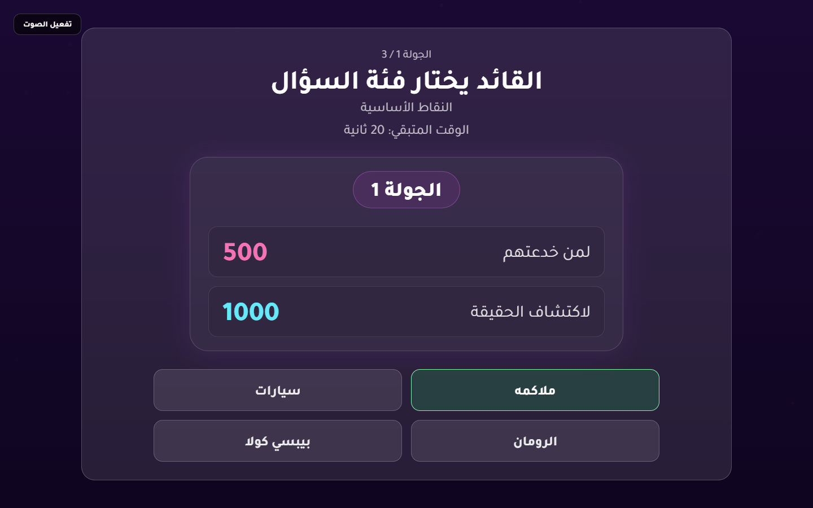

# 10-Player Live Stress Test x5 Summary

- Target URL: https://fgsh-web.vercel.app/
- Run timestamp: 2026-05-10 Asia/Riyadh
- Browser: Chromium via Playwright
- Player load: 10 isolated mobile player contexts plus TV/host context
- Credentials: supplied through environment variables and intentionally not logged.
- Result: 4 / 5 runs passed,  / 5 failed.
- TV category-selection flash: observed in  / 5 runs.
- Average run duration: 94.9 seconds.

## Per-Run Results

| Run | Status | Game Code | Category Flash Check | Relevant Errors | Total Timing | Report |
| --- | --- | --- | --- | --- | --- | --- |
| 1 | PASS | GYAK48 | PASS - 0 flash samples | 0 | 90904 ms | [run-01\stress-10-players.md](run-01\stress-10-players.md) |
| 2 | FAIL | D7CGS1 | FAIL - 1 flash sample | 0 | 88876 ms | [run-02\stress-10-players.md](run-02\stress-10-players.md) |
| 3 | PASS | F3I8RL | PASS - 0 flash samples | 0 | 86622 ms | [run-03\stress-10-players.md](run-03\stress-10-players.md) |
| 4 | PASS | ZQQNL2 | PASS - 0 flash samples | 0 | 87940 ms | [run-04\stress-10-players.md](run-04\stress-10-players.md) |
| 5 | PASS | 3GGSE6 | PASS - 0 flash samples | 0 | 86984 ms | [run-05\stress-10-players.md](run-05\stress-10-players.md) |

## Finding

The issue is still ongoing on the live deployment. Run 2 reached round completion with zero relevant console/request errors, but the TV watcher captured the category-selection wait screen after answering had already begun.

## Failure Evidence

- Run 2 report: [run-02/stress-10-players.md](run-02/stress-10-players.md)
- Flash screenshot: [run-02/screenshots/category-flash-detected.png](run-02/screenshots/category-flash-detected.png)

