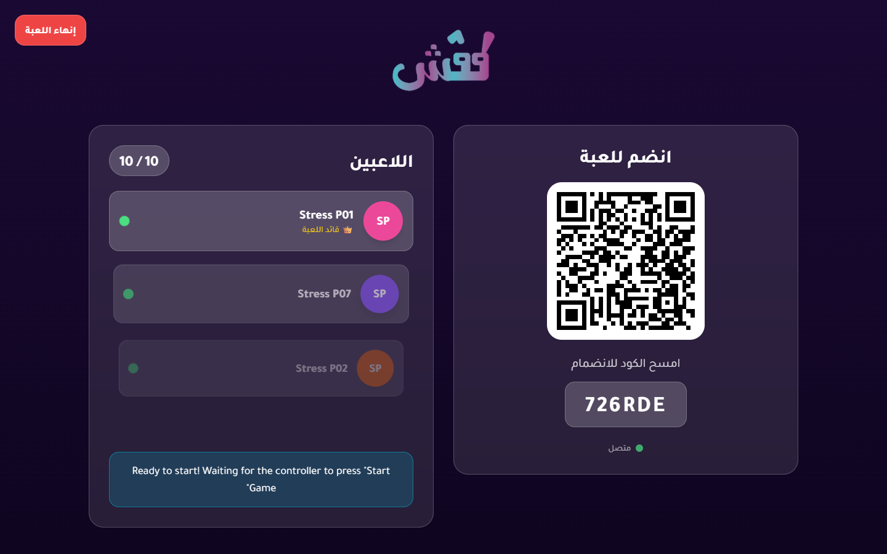
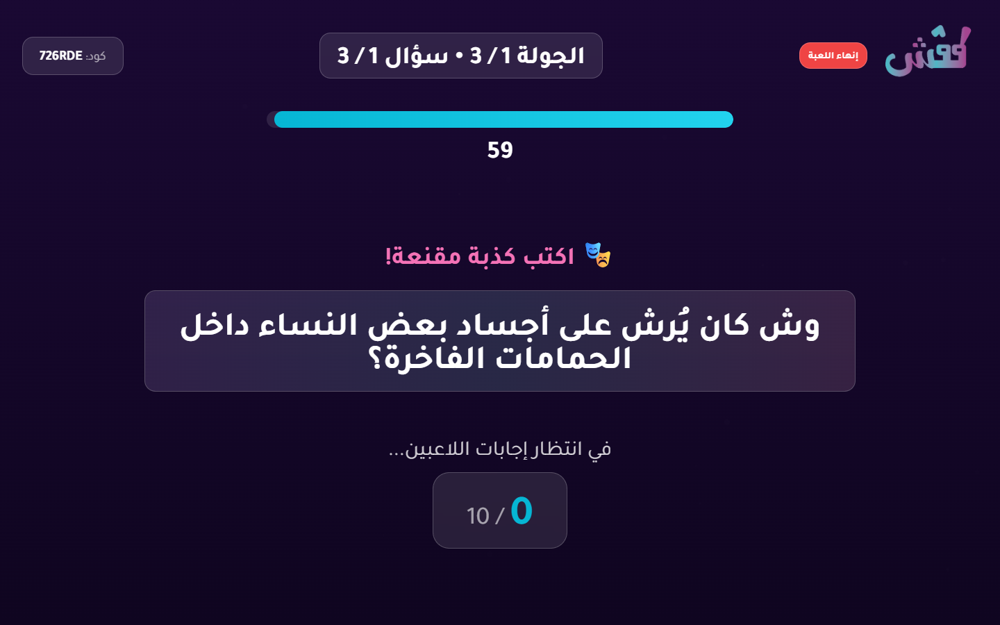
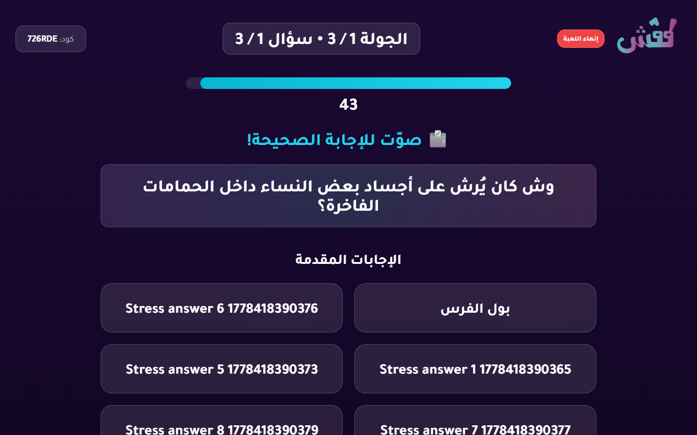
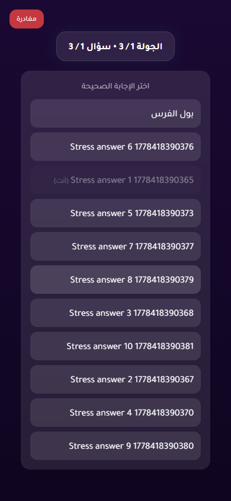
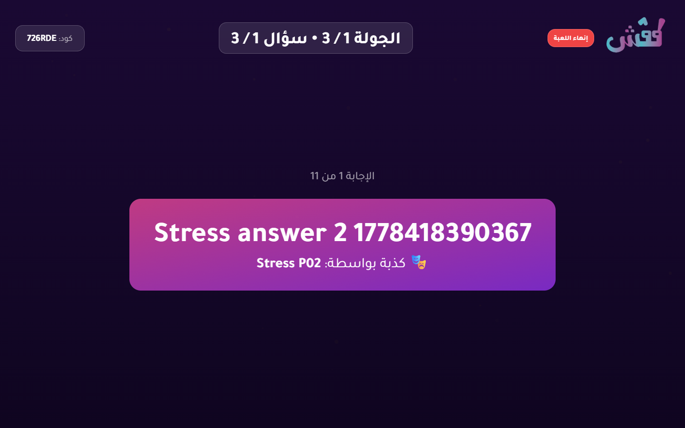

# 10-Player Stress Test Report

- Status: **PASS**
- Target URL: https://fgsh-web.vercel.app
- Started: 2026-05-10T13:05:54.355Z
- Completed: 2026-05-10T13:06:38.678Z
- Browser: chromium
- Viewports: TV/host 1440x900; players 390x844 in 10 isolated contexts
- Credentials: supplied through environment variables and intentionally not logged.
- Game code: 726RDE

## Acceptance Criteria

| Criterion | Status | Details |
| --- | --- | --- |
| Required environment variables are present | PASS | All required env vars are set. |
| Host can log in and create a TV room | PASS | Created TV room 726RDE. |
| 10 players join successfully | PASS | 10 players joined isolated browser contexts. |
| TV lobby displays 10 / 10 players | PASS | TV lobby displayed 10 / 10 players. |
| Game starts for TV and players | PASS | TV and player pages reached the first answering state. |
| All 10 answers confirm | PASS | All 10 player answer confirmations completed. |
| Voting opens for all players | PASS | Voting options appeared for all 10 players. |
| All 10 votes confirm | PASS | All 10 player vote confirmations completed. |
| Round reaches completed/reveal state | PASS | Voting options disappeared after completion, and completed/reveal screenshots were captured. |
| No unexpected TV category-selection flash after answering begins | PASS | No TV category-selection wait screen was observed after answering began. |
| No relevant framework/runtime errors | PASS | No relevant runtime, page, request, or HTTP 5xx errors were captured. |

## Timings

| Phase | Actor | Duration ms | Status | Details |
| --- | --- | ---: | --- | --- |
| create room | host | 3760 | PASS | Created TV room 726RDE. |
| join | Stress P01 | 2436 | PASS |  |
| join | Stress P02 | 2619 | PASS |  |
| join | Stress P05 | 2657 | PASS |  |
| join | Stress P10 | 2649 | PASS |  |
| join | Stress P09 | 2655 | PASS |  |
| join | Stress P06 | 2666 | PASS |  |
| join | Stress P08 | 2675 | PASS |  |
| join | Stress P03 | 2695 | PASS |  |
| join | Stress P04 | 2700 | PASS |  |
| join | Stress P07 | 2690 | PASS |  |
| start game | Stress P01 | 24892 | PASS |  |
| answer | Stress P02 | 411 | PASS |  |
| answer | Stress P03 | 427 | PASS |  |
| answer | Stress P06 | 421 | PASS |  |
| answer | Stress P05 | 508 | PASS |  |
| answer | Stress P08 | 503 | PASS |  |
| answer | Stress P04 | 513 | PASS |  |
| answer | Stress P01 | 519 | PASS |  |
| answer | Stress P09 | 505 | PASS |  |
| answer | Stress P07 | 509 | PASS |  |
| answer | Stress P10 | 506 | PASS |  |
| vote | Stress P01 | 3375 | PASS |  |
| vote | Stress P03 | 4218 | PASS |  |
| vote | Stress P08 | 4216 | PASS |  |
| vote | Stress P05 | 4218 | PASS |  |
| vote | Stress P10 | 4397 | PASS |  |
| vote | Stress P09 | 4398 | PASS |  |
| vote | Stress P06 | 4401 | PASS |  |
| vote | Stress P04 | 4402 | PASS |  |
| vote | Stress P02 | 4405 | PASS |  |
| vote | Stress P07 | 4403 | PASS |  |
| total | all | 44321 | PASS |  |

## Diagnostics

- Console/page/request records captured: 294
- Relevant error records: 0

_No relevant framework/runtime errors were recorded._

## Failure / Blockers

_No blockers recorded._

## Screenshots

TV lobby with 10 players

TV answering state

Player answering state

TV voting state

Player voting state

TV completed/reveal state

Player completed state

