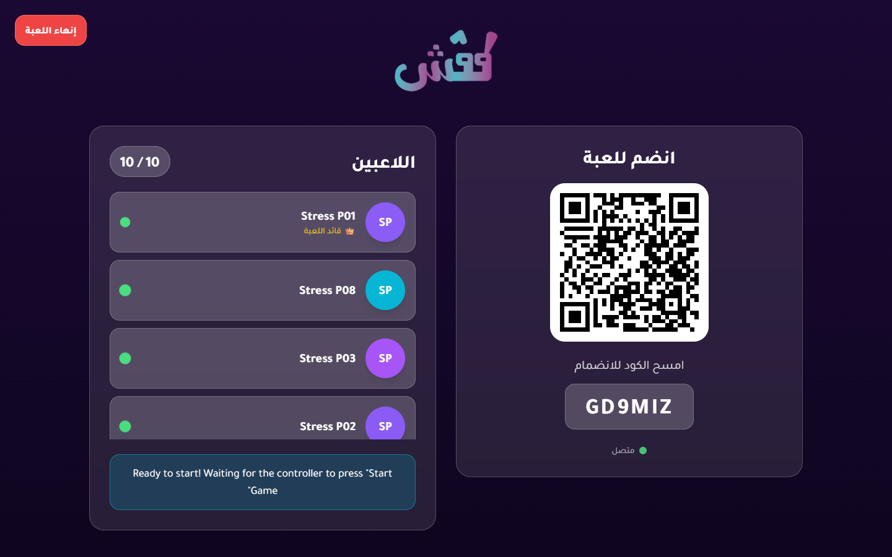
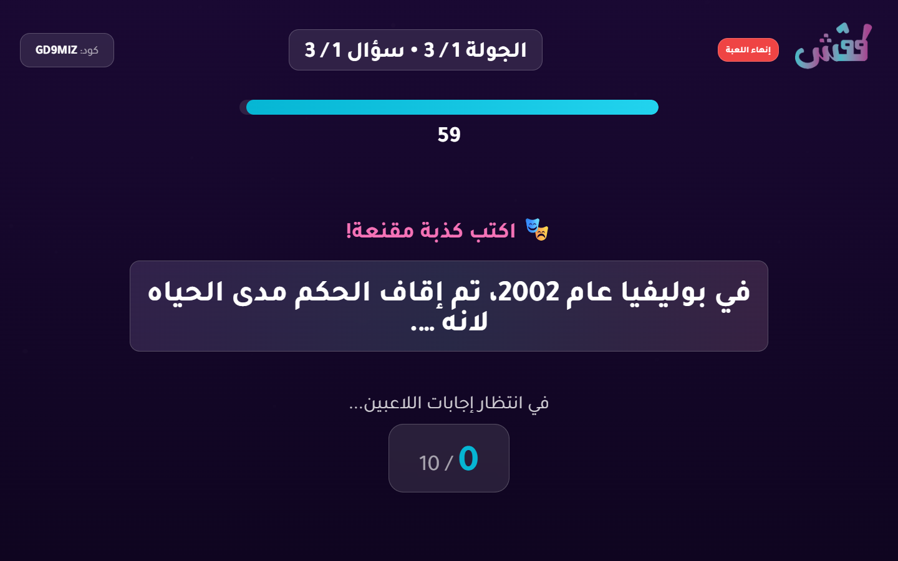
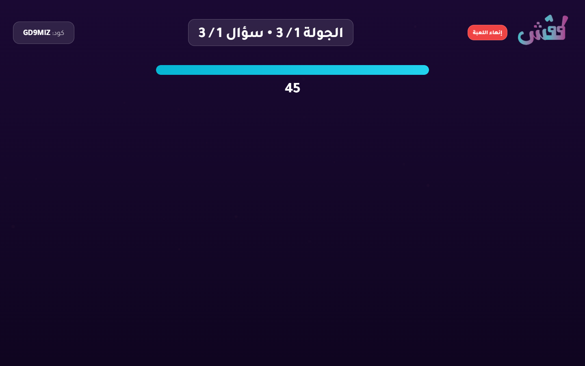
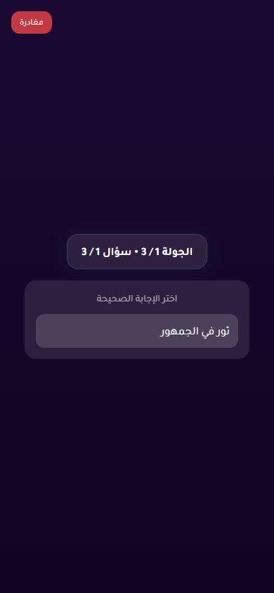
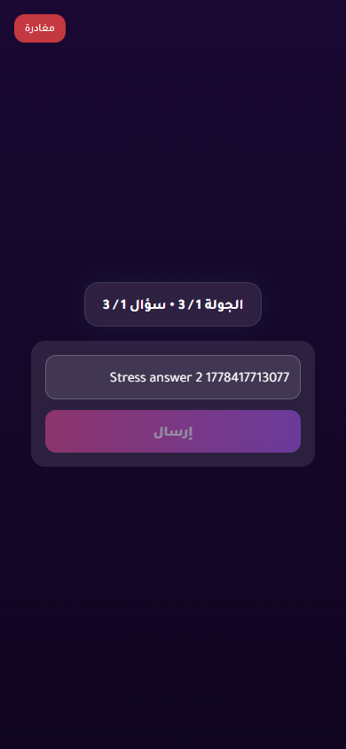

# 10-Player Stress Test Report

- Status: **FAIL**
- Target URL: https://fgsh-web.vercel.app
- Started: 2026-05-10T12:54:36.670Z
- Completed: 2026-05-10T12:56:13.360Z
- Browser: chromium
- Viewports: TV/host 1440x900; players 390x844 in 10 isolated contexts
- Credentials: supplied through environment variables and intentionally not logged.
- Game code: GD9MIZ

## Acceptance Criteria

| Criterion | Status | Details |
| --- | --- | --- |
| Required environment variables are present | PASS | All required env vars are set. |
| Host can log in and create a TV room | PASS | Created TV room GD9MIZ. |
| 10 players join successfully | PASS | 10 players joined isolated browser contexts. |
| TV lobby displays 10 / 10 players | PASS | TV lobby displayed 10 / 10 players. |
| Game starts for TV and players | PASS | TV and player pages reached the first answering state. |
| All 10 answers confirm | PASS | All 10 player answer confirmations completed. |
| Voting opens for all players | NOT RUN | Not reached. |
| All 10 votes confirm | NOT RUN | Not reached. |
| Round reaches completed/reveal state | NOT RUN | Not reached. |
| No unexpected TV category-selection flash after answering begins | PASS | No TV category-selection wait screen was observed after answering began before failure. |
| No relevant framework/runtime errors | NOT RUN | Not reached. |

## Timings

| Phase | Actor | Duration ms | Status | Details |
| --- | --- | ---: | --- | --- |
| create room | host | 3976 | PASS | Created TV room GD9MIZ. |
| join | Stress P01 | 2441 | PASS |  |
| join | Stress P08 | 2406 | PASS |  |
| join | Stress P03 | 2509 | PASS |  |
| join | Stress P02 | 2541 | PASS |  |
| join | Stress P07 | 2546 | PASS |  |
| join | Stress P05 | 2554 | PASS |  |
| join | Stress P06 | 2564 | PASS |  |
| join | Stress P04 | 2767 | PASS |  |
| join | Stress P10 | 2811 | PASS |  |
| join | Stress P09 | 2823 | PASS |  |
| start game | Stress P01 | 24749 | PASS |  |
| answer | Stress P06 | 266 | PASS |  |
| answer | Stress P04 | 269 | PASS |  |
| answer | Stress P07 | 267 | PASS |  |
| answer | Stress P03 | 273 | PASS |  |
| answer | Stress P09 | 269 | PASS |  |
| answer | Stress P02 | 274 | PASS |  |
| answer | Stress P05 | 273 | PASS |  |
| answer | Stress P10 | 270 | PASS |  |
| answer | Stress P08 | 272 | PASS |  |
| answer | Stress P01 | 288 | PASS |  |
| total | all | 96689 | FAIL | expect(received).toBeGreaterThan(expected)  Expected: > 1 Received:   1  Call Log: - Timeout 60000ms exceeded while waiting on the predicate |

## Diagnostics

- Console/page/request records captured: 308
- Relevant error records: 20

| Source | Type | Status | URL | Message |
| --- | --- | ---: | --- | --- |
| Stress P02 | console |  | https://fgsh-web.vercel.app/game | [error] Failed to load resource: the server responded with a status of 400 () |
| Stress P02 | console |  | https://fgsh-web.vercel.app/game | [error] Failed to submit: {message: Answer submit failed [42P10]: there is no unique o…constraint matching the ON CONFLICT specification, name: GameError, stack: GameError: Answer submit failed [42P10]: there is …web.vercel.app/assets/index-265398fa.js:374:26523} |
| Stress P03 | console |  | https://fgsh-web.vercel.app/game | [error] Failed to load resource: the server responded with a status of 400 () |
| Stress P08 | console |  | https://fgsh-web.vercel.app/game | [error] Failed to load resource: the server responded with a status of 400 () |
| Stress P03 | console |  | https://fgsh-web.vercel.app/game | [error] Failed to submit: {message: Answer submit failed [42P10]: there is no unique o…constraint matching the ON CONFLICT specification, name: GameError, stack: GameError: Answer submit failed [42P10]: there is …web.vercel.app/assets/index-265398fa.js:374:26523} |
| Stress P08 | console |  | https://fgsh-web.vercel.app/game | [error] Failed to submit: {message: Answer submit failed [42P10]: there is no unique o…constraint matching the ON CONFLICT specification, name: GameError, stack: GameError: Answer submit failed [42P10]: there is …web.vercel.app/assets/index-265398fa.js:374:26523} |
| Stress P07 | console |  | https://fgsh-web.vercel.app/game | [error] Failed to load resource: the server responded with a status of 400 () |
| Stress P07 | console |  | https://fgsh-web.vercel.app/game | [error] Failed to submit: {message: Answer submit failed [42P10]: there is no unique o…constraint matching the ON CONFLICT specification, name: GameError, stack: GameError: Answer submit failed [42P10]: there is …web.vercel.app/assets/index-265398fa.js:374:26523} |
| Stress P10 | console |  | https://fgsh-web.vercel.app/game | [error] Failed to load resource: the server responded with a status of 400 () |
| Stress P10 | console |  | https://fgsh-web.vercel.app/game | [error] Failed to submit: {message: Answer submit failed [42P10]: there is no unique o…constraint matching the ON CONFLICT specification, name: GameError, stack: GameError: Answer submit failed [42P10]: there is …web.vercel.app/assets/index-265398fa.js:374:26523} |
| Stress P06 | console |  | https://fgsh-web.vercel.app/game | [error] Failed to load resource: the server responded with a status of 400 () |
| Stress P06 | console |  | https://fgsh-web.vercel.app/game | [error] Failed to submit: {message: Answer submit failed [42P10]: there is no unique o…constraint matching the ON CONFLICT specification, name: GameError, stack: GameError: Answer submit failed [42P10]: there is …web.vercel.app/assets/index-265398fa.js:374:26523} |
| Stress P09 | console |  | https://fgsh-web.vercel.app/game | [error] Failed to load resource: the server responded with a status of 400 () |
| Stress P09 | console |  | https://fgsh-web.vercel.app/game | [error] Failed to submit: {message: Answer submit failed [42P10]: there is no unique o…constraint matching the ON CONFLICT specification, name: GameError, stack: GameError: Answer submit failed [42P10]: there is …web.vercel.app/assets/index-265398fa.js:374:26523} |
| Stress P04 | console |  | https://fgsh-web.vercel.app/game | [error] Failed to load resource: the server responded with a status of 400 () |
| Stress P04 | console |  | https://fgsh-web.vercel.app/game | [error] Failed to submit: {message: Answer submit failed [42P10]: there is no unique o…constraint matching the ON CONFLICT specification, name: GameError, stack: GameError: Answer submit failed [42P10]: there is …web.vercel.app/assets/index-265398fa.js:374:26523} |
| Stress P05 | console |  | https://fgsh-web.vercel.app/game | [error] Failed to load resource: the server responded with a status of 400 () |
| Stress P01 | console |  | https://fgsh-web.vercel.app/game | [error] Failed to load resource: the server responded with a status of 400 () |
| Stress P05 | console |  | https://fgsh-web.vercel.app/game | [error] Failed to submit: {message: Answer submit failed [42P10]: there is no unique o…constraint matching the ON CONFLICT specification, name: GameError, stack: GameError: Answer submit failed [42P10]: there is …web.vercel.app/assets/index-265398fa.js:374:26523} |
| Stress P01 | console |  | https://fgsh-web.vercel.app/game | [error] Failed to submit: {message: Answer submit failed [42P10]: there is no unique o…constraint matching the ON CONFLICT specification, name: GameError, stack: GameError: Answer submit failed [42P10]: there is …web.vercel.app/assets/index-265398fa.js:374:26523} |

## Failure / Blockers

- expect(received).toBeGreaterThan(expected)

Expected: > 1
Received:   1

Call Log:
- Timeout 60000ms exceeded while waiting on the predicate

## Screenshots

TV lobby with 10 players

TV answering state

Player answering state

Failure state - TV/host

Failure state - Stress P01

Failure state - Stress P02

