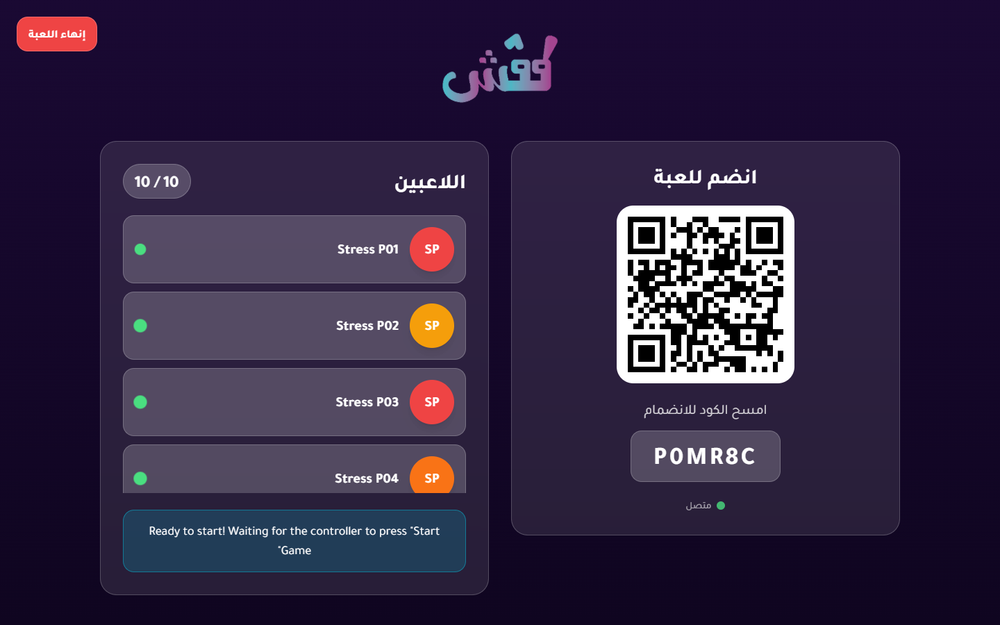
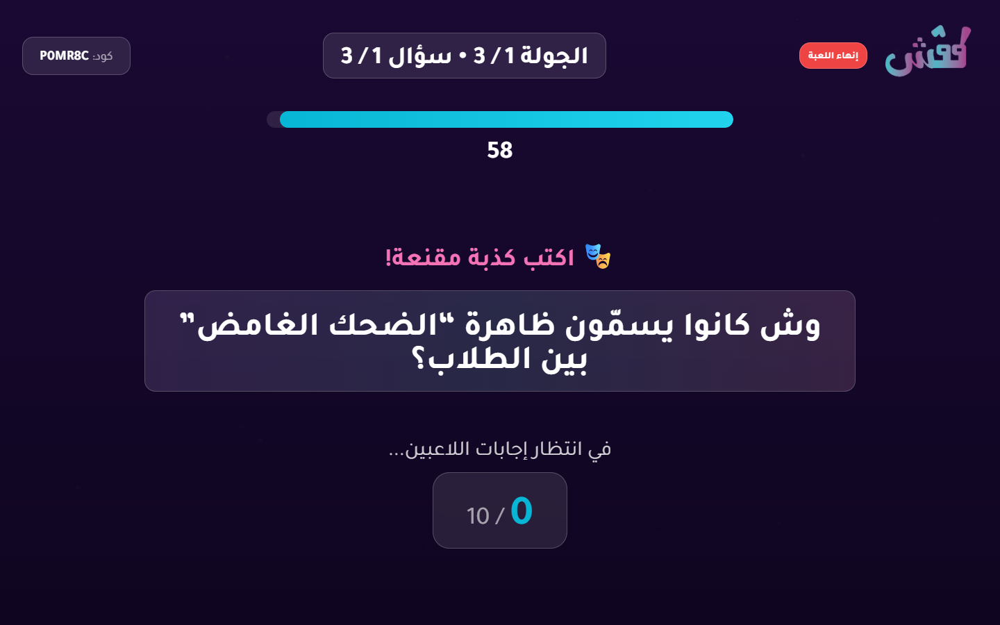
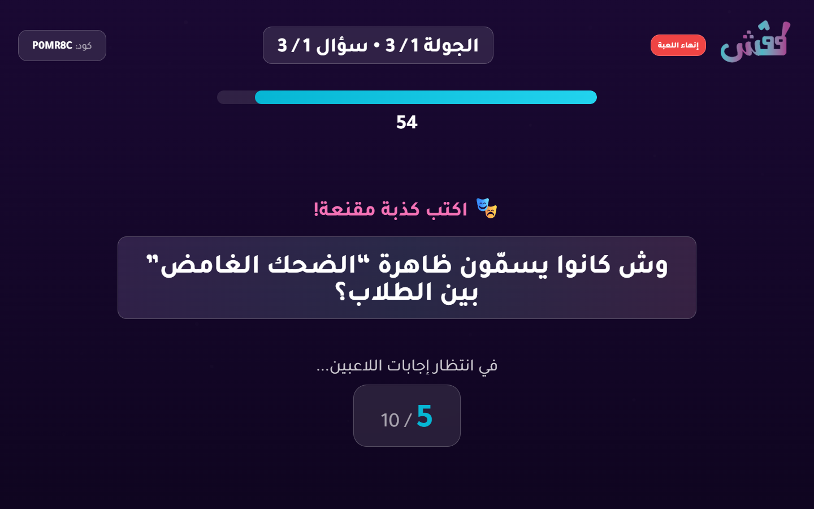
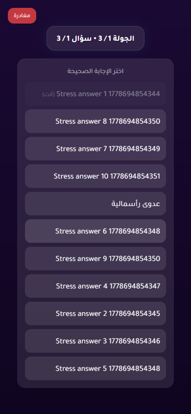
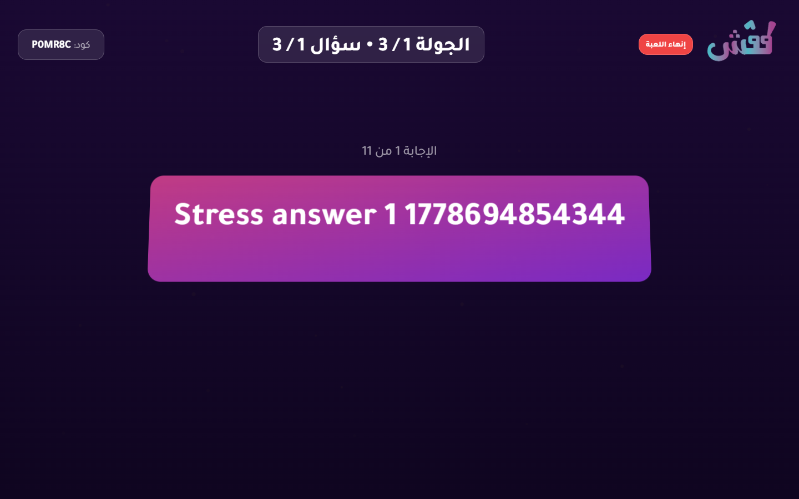
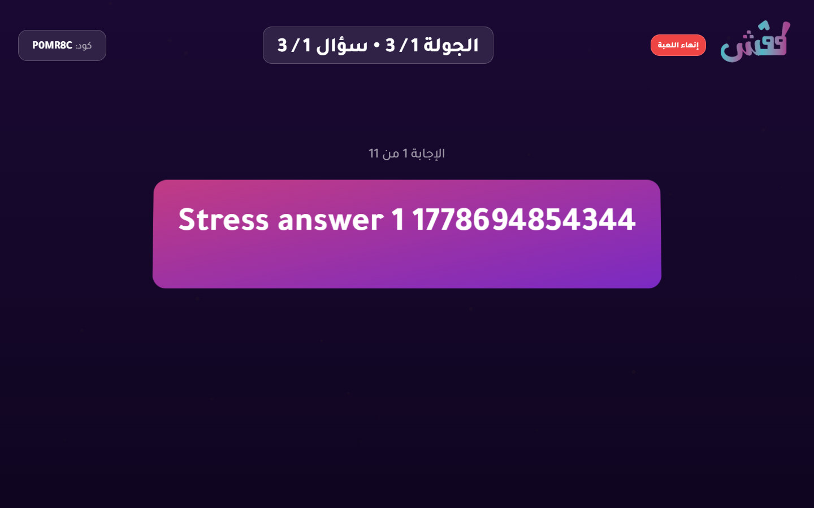

# 10-Player Stress Test Report

- Status: **FAIL**
- Target URL: http://127.0.0.1:5190
- Started: 2026-05-13T17:53:37.937Z
- Completed: 2026-05-13T17:54:21.276Z
- Browser: chromium
- Viewports: TV/host 1440x900; players 390x844 in 10 isolated contexts
- Credentials: supplied through environment variables and intentionally not logged.
- Game code: P0MR8C

## Acceptance Criteria

| Criterion | Status | Details |
| --- | --- | --- |
| Required environment variables are present | PASS | All required env vars are set. |
| Host can log in and create a TV room | PASS | Created TV room P0MR8C. |
| 10 players join successfully | PASS | 10 players joined isolated browser contexts. |
| TV lobby displays 10 / 10 players | PASS | TV lobby displayed 10 / 10 players. |
| Game starts for TV and players | PASS | TV and player pages reached the first answering state. |
| All 10 answers confirm | PASS | All 10 player answer confirmations completed. |
| Voting opens promptly after answer quorum | PASS | Voting opened 2951 ms after the last answer confirmation. |
| Voting opens for all players | PASS | Voting options appeared for all 10 players. |
| All 10 votes confirm | PASS | All 10 player vote confirmations completed. |
| Round reaches completed/reveal state | PASS | Voting options disappeared after completion, and completed/reveal screenshots were captured. |
| No unexpected TV category-selection flash after answering begins | PASS | No TV category-selection wait screen was observed after answering began. |
| No relevant framework/runtime errors | FAIL | 2 relevant diagnostic records were captured. |

## Timings

| Phase | Actor | Duration ms | Status | Details |
| --- | --- | ---: | --- | --- |
| create room | host | 4236 | PASS | Created TV room P0MR8C. |
| join | Stress P01 | 1583 | PASS |  |
| join | Stress P03 | 1814 | PASS |  |
| join | Stress P04 | 1970 | PASS |  |
| join | Stress P05 | 1972 | PASS |  |
| join | Stress P07 | 1975 | PASS |  |
| join | Stress P10 | 1999 | PASS |  |
| join | Stress P02 | 2034 | PASS |  |
| join | Stress P08 | 2027 | PASS |  |
| join | Stress P06 | 2310 | PASS |  |
| join | Stress P09 | 2361 | PASS |  |
| start game | Stress P01 | 26429 | PASS |  |
| answer | Stress P04 | 262 | PASS |  |
| answer | Stress P05 | 262 | PASS |  |
| answer | Stress P02 | 267 | PASS |  |
| answer | Stress P07 | 268 | PASS |  |
| answer | Stress P08 | 273 | PASS |  |
| answer | Stress P03 | 291 | PASS |  |
| answer | Stress P09 | 306 | PASS |  |
| answer | Stress P06 | 310 | PASS |  |
| answer | Stress P10 | 308 | PASS |  |
| answer | Stress P01 | 316 | PASS |  |
| answer quorum -> voting | all | 2951 | PASS | 2951 ms after the last answer confirmation. |
| vote | Stress P06 | 2206 | PASS |  |
| vote | Stress P08 | 3241 | PASS |  |
| vote | Stress P04 | 3244 | PASS |  |
| vote | Stress P09 | 3246 | PASS |  |
| vote | Stress P07 | 3250 | PASS |  |
| vote | Stress P10 | 3250 | PASS |  |
| vote | Stress P02 | 3256 | PASS |  |
| vote | Stress P01 | 3257 | PASS |  |
| vote | Stress P03 | 3256 | PASS |  |
| vote | Stress P05 | 3256 | PASS |  |
| total | all | 43186 | FAIL |  |
| total | all | 43338 | FAIL | stress-test acceptance status  expect(received).toBe(expected) // Object.is equality  Expected: "pass" Received: "fail" |

## Diagnostics

- Console/page/request records captured: 286
- Relevant error records: 2

| Source | Type | Status | URL | Message |
| --- | --- | ---: | --- | --- |
| TV/host | console |  | http://127.0.0.1:5190/create | [error] Failed to load resource: the server responded with a status of 404 (Not Found) |
| TV/host | console |  | http://127.0.0.1:5190/tv/game | [error] Failed to load resource: the server responded with a status of 404 (Not Found) |

## Failure / Blockers

- stress-test acceptance status

expect(received).toBe(expected) // Object.is equality

Expected: "pass"
Received: "fail"

## Screenshots

TV lobby with 10 players

TV answering state

Player answering state

TV voting state

Player voting state

TV completed/reveal state

Player completed state

Failure state - TV/host

Failure state - Stress P01

Failure state - Stress P02

