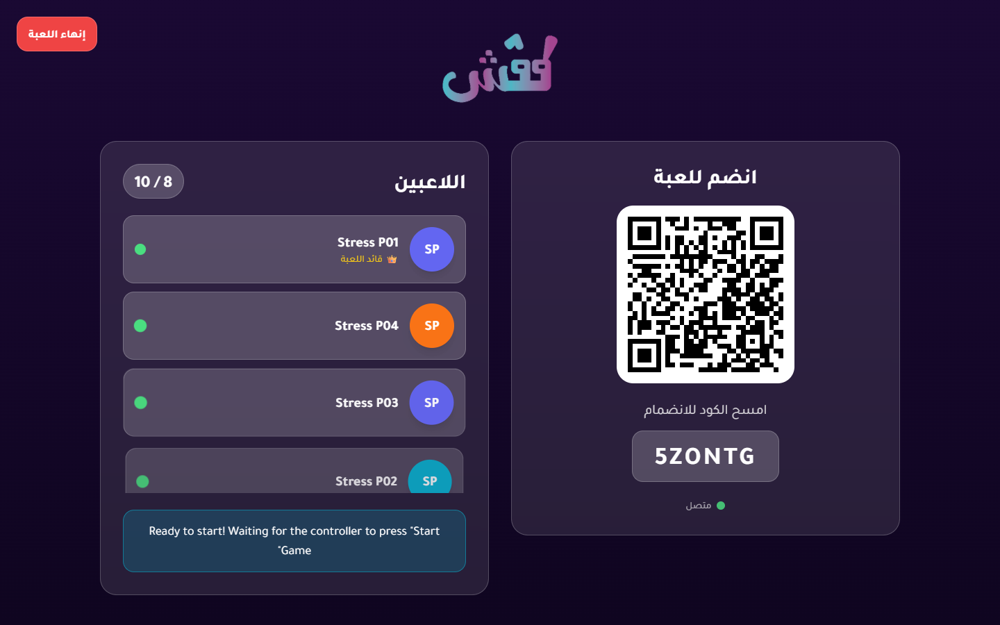
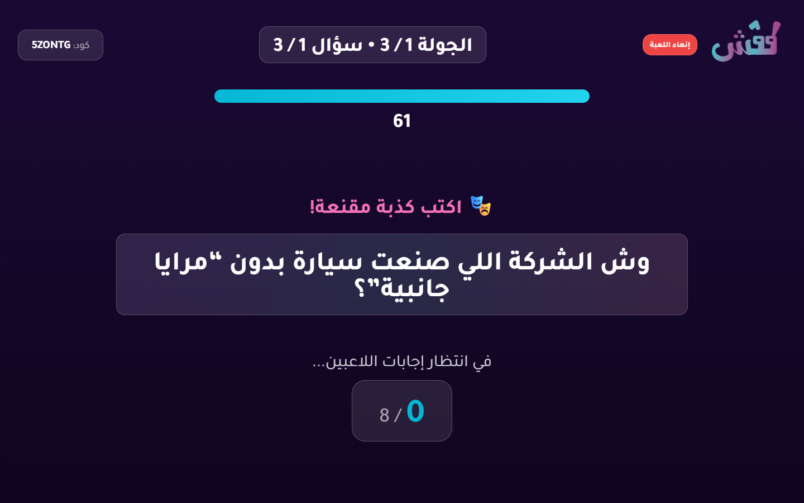
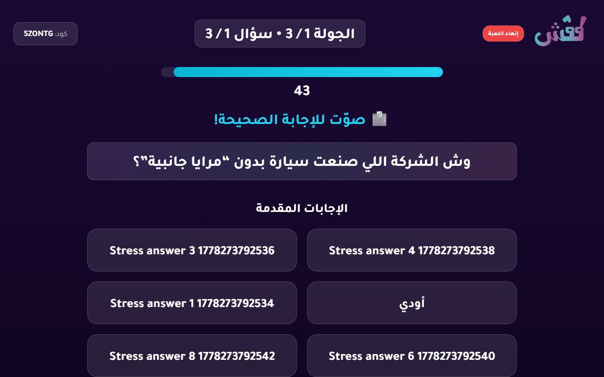
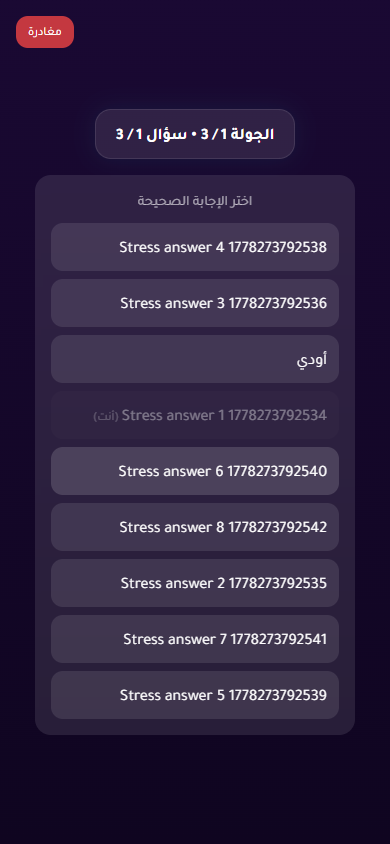
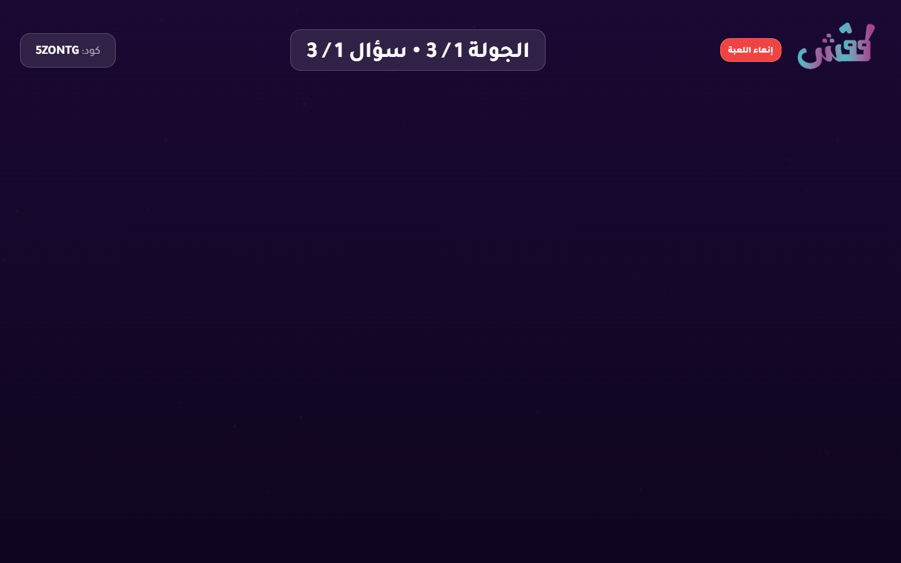
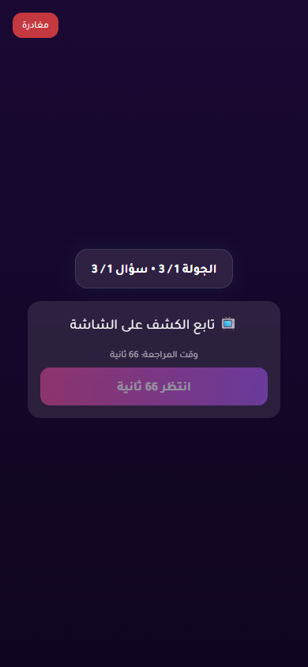

# 8-Player Stress Test Report

- Status: **PASS**
- Target URL: https://fgsh-web.vercel.app
- Started: 2026-05-08T20:55:56.545Z
- Completed: 2026-05-08T20:57:22.489Z
- Browser: chromium
- Viewports: TV/host 1440x900; players 390x844 in 8 isolated contexts
- Credentials: supplied through environment variables and intentionally not logged.
- Game code: 5ZONTG

## Acceptance Criteria

| Criterion | Status | Details |
| --- | --- | --- |
| Required environment variables are present | PASS | All required env vars are set. |
| Host can log in and create a TV room | PASS | Created TV room 5ZONTG. |
| 8 players join successfully | PASS | 8 players joined isolated browser contexts. |
| TV lobby displays 8 / 10 players | PASS | TV lobby displayed 8 / 10 players. |
| Game starts for TV and players | PASS | TV and player pages reached the first answering state. |
| All 8 answers confirm | PASS | All 8 player answer confirmations completed. |
| Voting opens for all players | PASS | Voting options appeared for all 8 players. |
| All 8 votes confirm | PASS | All 8 player vote confirmations completed. |
| Round reaches completed/reveal state | PASS | Voting options disappeared after completion, and completed/reveal screenshots were captured. |
| No relevant framework/runtime errors | PASS | No relevant runtime, page, request, or HTTP 5xx errors were captured. |

## Timings

| Phase | Actor | Duration ms | Status | Details |
| --- | --- | ---: | --- | --- |
| create room | host | 3795 | PASS | Created TV room 5ZONTG. |
| join | Stress P01 | 2373 | PASS |  |
| join | Stress P04 | 2456 | PASS |  |
| join | Stress P03 | 2475 | PASS |  |
| join | Stress P02 | 2515 | PASS |  |
| join | Stress P08 | 2539 | PASS |  |
| join | Stress P05 | 2621 | PASS |  |
| join | Stress P06 | 2664 | PASS |  |
| join | Stress P07 | 3021 | PASS |  |
| start game | Stress P01 | 24789 | PASS |  |
| answer | Stress P03 | 127 | PASS |  |
| answer | Stress P05 | 125 | PASS |  |
| answer | Stress P08 | 124 | PASS |  |
| answer | Stress P07 | 126 | PASS |  |
| answer | Stress P02 | 172 | PASS |  |
| answer | Stress P01 | 175 | PASS |  |
| answer | Stress P04 | 171 | PASS |  |
| answer | Stress P06 | 170 | PASS |  |
| vote | Stress P03 | 134 | PASS |  |
| vote | Stress P08 | 130 | PASS |  |
| vote | Stress P04 | 139 | PASS |  |
| vote | Stress P02 | 141 | PASS |  |
| vote | Stress P07 | 147 | PASS |  |
| vote | Stress P05 | 157 | PASS |  |
| vote | Stress P06 | 162 | PASS |  |
| vote | Stress P01 | 176 | PASS |  |
| total | all | 85942 | PASS |  |

## Diagnostics

- Console/page/request records captured: 225
- Relevant error records: 0

_No relevant framework/runtime errors were recorded._

## Failure / Blockers

_No blockers recorded._

## Screenshots

TV lobby with 8 players

TV answering state

Player answering state

TV voting state

Player voting state

TV completed/reveal state

Player completed state

